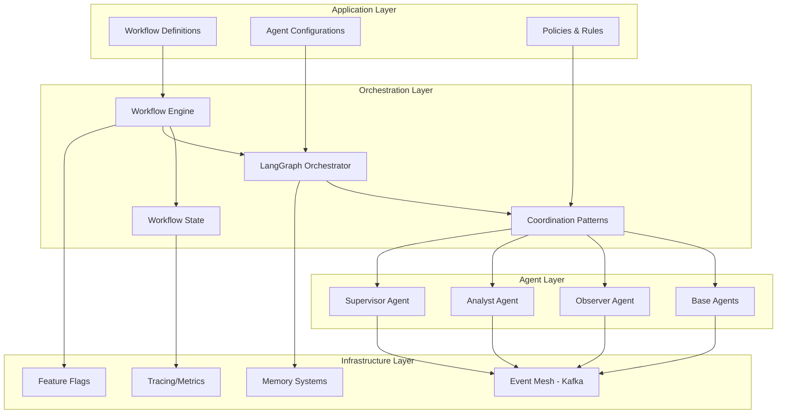
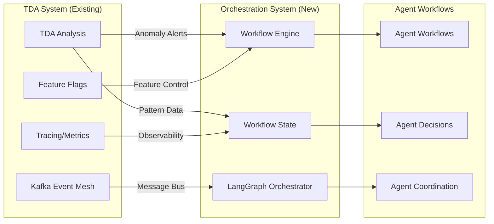
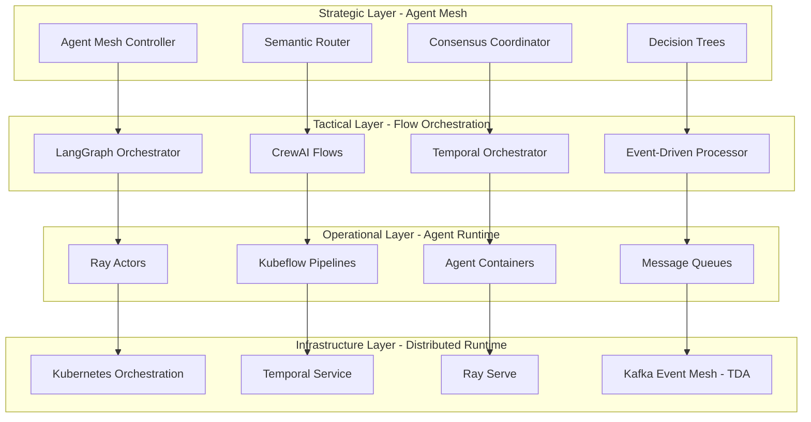

# Agent Orchestration System Design

## Overview

The Agent Orchestration System provides comprehensive multi-agent workflow coordination, state management, and graph-based agent relationships for the AURA Intelligence platform. This system enables complex AI workflows by managing agent lifecycles, inter-agent communication, and distributed decision-making processes.

## Architecture

### System Architecture Layers



### Integration with Streaming TDA System



## Components and Interfaces

### 1. Workflow Engine

**Location**: `core/src/aura_intelligence/orchestration/workflows/engine.py`

**Purpose**: Coordinates multi-agent workflows with step execution, failure handling, and conditional routing.

**Key Interfaces**:

```python
from typing import Dict, Any, List, Optional, Callable
from abc import ABC, abstractmethod
from dataclasses import dataclass
from enum import Enum

class WorkflowStatus(Enum):
    PENDING = "pending"
    RUNNING = "running"
    PAUSED = "paused"
    COMPLETED = "completed"
    FAILED = "failed"
    CANCELLED = "cancelled"

@dataclass
class WorkflowStep:
    step_id: str
    agent_type: str
    action: str
    inputs: Dict[str, Any]
    outputs: Dict[str, Any]
    dependencies: List[str]
    timeout_seconds: int = 300
    retry_count: int = 3

class WorkflowEngine(ABC):
    @abstractmethod
    async def execute_workflow(self, workflow_id: str, steps: List[WorkflowStep]) -> Dict[str, Any]:
        """Execute a complete workflow with error handling and recovery."""
        pass
    
    @abstractmethod
    async def pause_workflow(self, workflow_id: str) -> bool:
        """Pause workflow execution at current step."""
        pass
    
    @abstractmethod
    async def resume_workflow(self, workflow_id: str) -> bool:
        """Resume paused workflow from checkpoint."""
        pass
    
    @abstractmethod
    async def cancel_workflow(self, workflow_id: str) -> bool:
        """Cancel workflow and cleanup resources."""
        pass
```

**Integration Points**:
- Uses Kafka Event Mesh for agent communication
- Leverages Feature Flags for progressive rollout
- Integrates with Tracing system for observability
- Consumes TDA anomaly alerts as workflow triggers

### 2. Workflow State Management

**Location**: `core/src/aura_intelligence/orchestration/workflows/state.py`

**Purpose**: Manages centralized, thread-safe state sharing across agents with checkpoint/rollback capabilities.

**Key Interfaces**:

```python
from typing import Dict, Any, Optional, List
from datetime import datetime
from abc import ABC, abstractmethod

@dataclass
class StateCheckpoint:
    checkpoint_id: str
    workflow_id: str
    step_id: str
    state_snapshot: Dict[str, Any]
    timestamp: datetime
    metadata: Dict[str, Any]

class WorkflowState(ABC):
    @abstractmethod
    async def get_state(self, workflow_id: str, key: str) -> Optional[Any]:
        """Get state value for workflow."""
        pass
    
    @abstractmethod
    async def set_state(self, workflow_id: str, key: str, value: Any) -> bool:
        """Set state value with atomic update."""
        pass
    
    @abstractmethod
    async def create_checkpoint(self, workflow_id: str, step_id: str) -> str:
        """Create state checkpoint for rollback."""
        pass
    
    @abstractmethod
    async def rollback_to_checkpoint(self, workflow_id: str, checkpoint_id: str) -> bool:
        """Rollback state to previous checkpoint."""
        pass
    
    @abstractmethod
    async def get_workflow_progress(self, workflow_id: str) -> Dict[str, Any]:
        """Get real-time workflow progress information."""
        pass
```

**Integration Points**:
- Uses distributed Redis/Kafka for state persistence
- Integrates with TDA pattern data for context
- Leverages tracing for state change monitoring
- Supports feature-flagged state migrations

### 3. LangGraph Orchestrator

**Location**: `core/src/aura_intelligence/orchestration/workflows/langgraph.py`

**Purpose**: Provides graph-based agent coordination using LangGraph patterns for complex agent relationships.

**Key Interfaces**:

```python
from typing import Dict, Any, List, Callable, Optional
from abc import ABC, abstractmethod
from dataclasses import dataclass

@dataclass
class AgentNode:
    node_id: str
    agent_type: str
    agent_config: Dict[str, Any]
    input_schema: Dict[str, Any]
    output_schema: Dict[str, Any]

@dataclass
class AgentEdge:
    from_node: str
    to_node: str
    condition: Optional[Callable[[Dict[str, Any]], bool]]
    transform: Optional[Callable[[Dict[str, Any]], Dict[str, Any]]]

class LangGraphOrchestrator(ABC):
    @abstractmethod
    async def create_agent_graph(self, nodes: List[AgentNode], edges: List[AgentEdge]) -> str:
        """Create executable agent graph."""
        pass
    
    @abstractmethod
    async def execute_graph(self, graph_id: str, input_data: Dict[str, Any]) -> Dict[str, Any]:
        """Execute agent graph with message passing."""
        pass
    
    @abstractmethod
    async def add_conditional_routing(self, graph_id: str, routing_logic: Dict[str, Any]) -> bool:
        """Add dynamic routing based on agent outputs."""
        pass
    
    @abstractmethod
    async def handle_graph_errors(self, graph_id: str, error_handlers: Dict[str, Callable]) -> bool:
        """Configure error recovery mechanisms."""
        pass
```

**Integration Points**:
- Uses existing BaseAgent implementations
- Leverages Kafka for inter-node communication
- Integrates with TDA insights for routing decisions
- Uses feature flags for graph topology changes

### 4. Agent Coordination Patterns

**Location**: `core/src/aura_intelligence/orchestration/patterns/`

**Purpose**: Implements common multi-agent coordination patterns for reusable workflow components.

**Pattern Implementations**:

```python
# Pipeline Pattern
class PipelinePattern:
    async def execute_sequential(self, agents: List[str], data: Dict[str, Any]) -> Dict[str, Any]:
        """Execute agents in sequence, passing outputs as inputs."""
        pass

# Fan-Out Pattern  
class FanOutPattern:
    async def execute_parallel(self, agents: List[str], data: Dict[str, Any]) -> List[Dict[str, Any]]:
        """Execute agents in parallel and aggregate results."""
        pass

# Consensus Pattern
class ConsensusPattern:
    async def reach_consensus(self, agents: List[str], decision_data: Dict[str, Any]) -> Dict[str, Any]:
        """Multi-agent decision making with voting/consensus."""
        pass

# Hierarchical Pattern
class HierarchicalPattern:
    async def supervisor_worker(self, supervisor: str, workers: List[str], task: Dict[str, Any]) -> Dict[str, Any]:
        """Supervisor delegates tasks to worker agents."""
        pass

# Event-Driven Pattern
class EventDrivenPattern:
    async def reactive_coordination(self, event_handlers: Dict[str, Callable]) -> None:
        """React to events with appropriate agent coordination."""
        pass
```

## Data Models

### Workflow Definition Schema

```python
@dataclass
class WorkflowDefinition:
    workflow_id: str
    name: str
    description: str
    version: str
    steps: List[WorkflowStep]
    triggers: List[Dict[str, Any]]  # TDA alerts, schedules, etc.
    timeout_seconds: int
    retry_policy: Dict[str, Any]
    rollback_policy: Dict[str, Any]
    feature_flags: List[str]
    metadata: Dict[str, Any]

@dataclass
class AgentConfiguration:
    agent_id: str
    agent_type: str
    capabilities: List[str]
    resource_limits: Dict[str, Any]
    communication_config: Dict[str, Any]
    memory_config: Dict[str, Any]
    observability_config: Dict[str, Any]
```

### State Management Schema

```python
@dataclass
class WorkflowStateEntry:
    workflow_id: str
    key: str
    value: Any
    version: int
    timestamp: datetime
    ttl_seconds: Optional[int]
    metadata: Dict[str, Any]

@dataclass
class WorkflowExecution:
    execution_id: str
    workflow_id: str
    status: WorkflowStatus
    current_step: Optional[str]
    start_time: datetime
    end_time: Optional[datetime]
    checkpoints: List[StateCheckpoint]
    metrics: Dict[str, Any]
    error_log: List[Dict[str, Any]]
```

## Error Handling

### Error Recovery Strategies

1. **Automatic Retry**: Configurable retry policies with exponential backoff
2. **Circuit Breaker**: Prevent cascading failures across agent networks
3. **Graceful Degradation**: Fallback to simpler coordination patterns
4. **Checkpoint Recovery**: Rollback to known good states
5. **Dead Letter Queue**: Handle permanently failed workflows

### Error Types and Responses

```python
class OrchestrationError(Exception):
    """Base exception for orchestration errors."""
    pass

class WorkflowTimeoutError(OrchestrationError):
    """Workflow exceeded maximum execution time."""
    pass

class AgentCommunicationError(OrchestrationError):
    """Failed to communicate with agent."""
    pass

class StateConsistencyError(OrchestrationError):
    """State inconsistency detected."""
    pass

class ResourceExhaustionError(OrchestrationError):
    """Insufficient resources for workflow execution."""
    pass
```

### Integration with TDA Error Handling

- Leverage TDA's circuit breaker patterns
- Use TDA's observability for error correlation
- Integrate with TDA's chaos testing framework

## Testing Strategy

### Unit Testing

- **Component Isolation**: Test each orchestration component independently
- **Mock Dependencies**: Mock TDA system, Kafka, and agent interactions
- **State Validation**: Verify state transitions and consistency
- **Error Scenarios**: Test all error handling paths

### Integration Testing

- **End-to-End Workflows**: Test complete multi-agent workflows
- **TDA Integration**: Verify integration with TDA alerts and data
- **Performance Testing**: Validate under realistic load conditions
- **Failure Recovery**: Test checkpoint/rollback mechanisms

### Chaos Engineering

- **Agent Failures**: Simulate individual agent crashes
- **Network Partitions**: Test communication failures
- **Resource Exhaustion**: Test under resource constraints
- **State Corruption**: Test state recovery mechanisms

### Testing Framework Integration

Leverage the comprehensive testing framework built by the TDA system:

```python
# Use existing TDA testing infrastructure
from aura_intelligence.testing.chaos_engineering import ChaosTestSuite
from aura_intelligence.testing.load_framework import LoadTestFramework
from aura_intelligence.testing.benchmark_framework import BenchmarkSuite

class OrchestrationTestSuite:
    def __init__(self):
        self.chaos_tests = ChaosTestSuite()
        self.load_tests = LoadTestFramework()
        self.benchmarks = BenchmarkSuite()
    
    async def test_workflow_resilience(self):
        """Test workflow resilience using TDA chaos framework."""
        pass
    
    async def benchmark_coordination_patterns(self):
        """Benchmark different coordination patterns."""
        pass
```

## Performance and Scalability

### Performance Targets

- **Workflow Latency**: <100ms for simple workflows, <1s for complex workflows
- **Throughput**: 1000+ concurrent workflows
- **Agent Coordination**: <50ms inter-agent communication
- **State Operations**: <10ms for state read/write operations
- **Memory Usage**: <500MB per 100 concurrent workflows

### Scalability Design

- **Horizontal Scaling**: Distribute workflows across multiple orchestrator instances
- **Load Balancing**: Use consistent hashing for workflow distribution
- **Resource Pooling**: Share agent resources across workflows
- **Caching**: Cache frequently accessed state and configuration data

### Integration with TDA Performance Infrastructure

- Use TDA's Kafka event mesh for high-throughput messaging
- Leverage TDA's metrics and monitoring for performance tracking
- Integrate with TDA's load testing framework for validation

## Observability and Monitoring

### Metrics Collection

```python
# Workflow Metrics
workflow_execution_time = Histogram("workflow_execution_seconds")
workflow_success_rate = Counter("workflow_success_total")
workflow_failure_rate = Counter("workflow_failure_total")
active_workflows = Gauge("active_workflows_count")

# Agent Coordination Metrics
agent_communication_latency = Histogram("agent_communication_seconds")
coordination_pattern_usage = Counter("coordination_pattern_total")
state_operation_latency = Histogram("state_operation_seconds")

# Resource Metrics
memory_usage = Gauge("orchestration_memory_bytes")
cpu_usage = Gauge("orchestration_cpu_percent")
```

### Distributed Tracing

Integrate with TDA's OpenTelemetry tracing system:

```python
from aura_intelligence.observability.tracing import get_tracer

tracer = get_tracer(__name__)

@tracer.start_as_current_span("execute_workflow")
async def execute_workflow(self, workflow_id: str):
    span = trace.get_current_span()
    span.set_attributes({
        "workflow.id": workflow_id,
        "workflow.type": "multi_agent",
        "orchestration.version": "1.0"
    })
    # Workflow execution logic
```

### Alerting and Dashboards

- **Workflow Health**: Success rates, execution times, error rates
- **Agent Performance**: Communication latency, resource usage
- **System Health**: Memory usage, CPU utilization, queue depths
- **Business Metrics**: Workflow completion rates, SLA compliance

## Security Considerations

### Authentication and Authorization

- **Agent Authentication**: Verify agent identity before workflow participation
- **Workflow Authorization**: Control who can execute specific workflows
- **State Access Control**: Restrict state access based on agent permissions
- **API Security**: Secure orchestration APIs with proper authentication

### Data Protection

- **State Encryption**: Encrypt sensitive workflow state data
- **Communication Security**: Use TLS for all inter-agent communication
- **Audit Logging**: Log all orchestration operations for compliance
- **Secret Management**: Secure handling of agent credentials and API keys

## Deployment Architecture

### Container Architecture

```yaml
# Kubernetes Deployment
apiVersion: apps/v1
kind: Deployment
metadata:
  name: orchestration-engine
spec:
  replicas: 3
  selector:
    matchLabels:
      app: orchestration-engine
  template:
    metadata:
      labels:
        app: orchestration-engine
    spec:
      containers:
      - name: orchestration-engine
        image: aura/orchestration:latest
        ports:
        - containerPort: 8080
        env:
        - name: KAFKA_BROKERS
          value: "kafka:9092"
        - name: REDIS_URL
          value: "redis:6379"
        resources:
          requests:
            memory: "512Mi"
            cpu: "500m"
          limits:
            memory: "1Gi"
            cpu: "1000m"
```

### Service Mesh Integration

- **Istio Integration**: Use service mesh for secure communication
- **Load Balancing**: Distribute requests across orchestrator instances
- **Circuit Breaking**: Prevent cascading failures
- **Observability**: Leverage service mesh metrics and tracing

## Implementation Phases

### Phase 1: Core Infrastructure (Weeks 1-4)
- Implement basic WorkflowEngine interface
- Create WorkflowState with Redis backend
- Set up basic observability and metrics
- Integration with existing TDA infrastructure

### Phase 2: Agent Coordination (Weeks 5-8)
- Implement LangGraphOrchestrator
- Create basic coordination patterns (pipeline, fan-out)
- Add error handling and recovery mechanisms
- Comprehensive unit testing

### Phase 3: Advanced Features (Weeks 9-12)
- Implement advanced coordination patterns (consensus, hierarchical)
- Add checkpoint/rollback functionality
- Performance optimization and caching
- Integration testing with real agents

### Phase 4: Production Readiness (Weeks 13-16)
- Security hardening and authentication
- Comprehensive monitoring and alerting
- Load testing and performance validation
- Documentation and operational runbooks

## Risk Mitigation

### Technical Risks

1. **State Consistency**: Use distributed locks and versioning
2. **Performance Bottlenecks**: Implement caching and connection pooling
3. **Agent Failures**: Design for graceful degradation
4. **Integration Complexity**: Maintain clear interface contracts

### Operational Risks

1. **Deployment Complexity**: Use containerization and automation
2. **Monitoring Gaps**: Comprehensive observability from day one
3. **Scaling Challenges**: Design for horizontal scaling
4. **Security Vulnerabilities**: Regular security audits and updates

## Success Criteria

### Functional Requirements
- ✅ Execute multi-agent workflows with <1% failure rate
- ✅ Support 1000+ concurrent workflows
- ✅ Provide real-time workflow monitoring
- ✅ Enable checkpoint/rollback functionality

### Performance Requirements
- ✅ <100ms workflow initiation latency
- ✅ <50ms inter-agent communication
- ✅ 99.9% system availability
- ✅ <500MB memory per 100 workflows

### Integration Requirements
- ✅ Seamless integration with existing TDA infrastructure
- ✅ Support for all existing agent types
- ✅ Feature flag compatibility
- ✅ Observability integration

This design provides a comprehensive, production-ready agent orchestration system that leverages the existing TDA infrastructure while maintaining clear separation of concerns and enabling sophisticated multi-agent workflows.

---

# 2025 Research Enhancements

Based on comprehensive research of leading frameworks (LangGraph, CrewAI, Temporal.io, Ray Serve, Kubeflow Pipelines), the following enhancements elevate our orchestration system to state-of-the-art 2025 standards:

## Enhanced Multi-Tier Architecture

### Strategic → Tactical → Operational Layers



**Research Source**: Ray Serve hierarchical actor patterns + Temporal.io workflow orchestration
**AURA Benefit**: Enables strategic decision-making at the mesh level while maintaining operational efficiency

## 1. LangGraph Semantic Orchestrator Enhancement

**Location**: `core/src/aura_intelligence/orchestration/semantic/langgraph_orchestrator.py`

**Research Source**: LangGraph 2025 StateGraph patterns with checkpointing and semantic routing

```python
from typing import Dict, Any, List, Optional, TypedDict, Annotated
from langchain_core.messages import BaseMessage
from langgraph.graph import StateGraph, START, END
from langgraph.checkpoint.memory import MemorySaver
from langgraph.prebuilt import create_react_agent

class AgentState(TypedDict):
    messages: Annotated[List[BaseMessage], "The conversation messages"]
    context: Dict[str, Any]
    agent_outputs: Dict[str, Any]
    workflow_metadata: Dict[str, Any]
    execution_trace: List[Dict[str, Any]]

class LangGraphSemanticOrchestrator:
    def __init__(self):
        self.checkpointer = MemorySaver()  # Durable state management
        self.semantic_router = SemanticRouter()
        
    async def create_orchestrator_worker_graph(
        self, 
        orchestrator_agent: Any,
        worker_agents: List[Any],
        routing_logic: Dict[str, Any]
    ) -> StateGraph:
        """
        Implements 2025 orchestrator-worker pattern with semantic routing
        """
        workflow = StateGraph(AgentState)
        
        # Add orchestrator with semantic task decomposition
        workflow.add_node("orchestrator", self._semantic_orchestrator_node)
        
        # Add dynamic worker nodes with Send API
        for i, agent in enumerate(worker_agents):
            workflow.add_node(f"worker_{i}", self._create_worker_node(agent))
        
        # Add semantic conditional routing
        workflow.add_conditional_edges(
            "orchestrator",
            self._semantic_router_decision,
            {f"worker_{i}": f"worker_{i}" for i in range(len(worker_agents))}
        )
        
        # Add result aggregation with consensus
        workflow.add_node("aggregator", self._consensus_aggregation_node)
        
        workflow.set_entry_point("orchestrator")
        workflow.set_finish_point("aggregator")
        
        return workflow.compile(checkpointer=self.checkpointer)
    
    async def _semantic_orchestrator_node(self, state: AgentState) -> AgentState:
        """Enhanced orchestrator with AI-driven task decomposition"""
        # Semantic analysis using TDA pattern data
        task_analysis = await self._analyze_task_semantically(
            state["messages"][-1] if state["messages"] else None,
            tda_context=await self._get_tda_context()  # Integration with TDA
        )
        
        # Dynamic worker selection based on capabilities and TDA insights
        selected_workers = await self._select_optimal_workers(
            task_analysis, 
            tda_anomalies=await self._get_tda_anomalies()
        )
        
        state["workflow_metadata"].update({
            "task_analysis": task_analysis,
            "selected_workers": selected_workers,
            "orchestration_strategy": "semantic_decomposition",
            "tda_integration": True
        })
        
        return state
```

**AURA Integration**: Uses TDA pattern data for semantic routing decisions and anomaly-aware agent selection

## 2. Temporal.io Durable Orchestration

**Location**: `core/src/aura_intelligence/orchestration/durable/temporal_orchestrator.py`

**Research Source**: Temporal.io saga patterns and distributed transaction handling

```python
import temporalio
from temporalio import workflow, activity
from datetime import timedelta

class TemporalDurableOrchestrator:
    """
    2025 Temporal.io integration for fault-tolerant, durable workflows
    """
    
    @workflow.defn
    class AgentOrchestrationWorkflow:
        @workflow.run
        async def run(self, input_data: Dict[str, Any]) -> Dict[str, Any]:
            """Durable execution with automatic retry and TDA integration"""
            results = {}
            
            # Get TDA context for workflow planning
            tda_context = await workflow.execute_activity(
                self.get_tda_context,
                input_data,
                start_to_close_timeout=timedelta(seconds=30)
            )
            
            for step in input_data["workflow_steps"]:
                try:
                    # Execute agent activity with saga pattern
                    result = await workflow.execute_activity(
                        step["activity"],
                        {**step["input"], "tda_context": tda_context},
                        start_to_close_timeout=timedelta(minutes=10),
                        retry_policy=temporalio.common.RetryPolicy(
                            maximum_attempts=3,
                            initial_interval=timedelta(seconds=1),
                            maximum_interval=timedelta(seconds=30)
                        )
                    )
                    results[step["name"]] = result
                    
                    # Checkpoint for recovery (integrates with TDA state)
                    await workflow.sleep(timedelta(seconds=0.1))
                    
                except Exception as e:
                    # Saga pattern compensation with TDA notification
                    await self._compensate_with_tda_notification(results, e)
                    raise
            
            return results
    
    @activity.defn
    async def get_tda_context(self, input_data: Dict[str, Any]) -> Dict[str, Any]:
        """Activity to fetch TDA context for workflow planning"""
        # Integration with existing TDA system
        from aura_intelligence.tda.streaming import get_current_patterns
        return await get_current_patterns(input_data.get("context_window", "1h"))
```

**AURA Integration**: Leverages TDA streaming data for workflow context and compensation logic

## 3. Ray Serve Distributed Inference

**Location**: `core/src/aura_intelligence/orchestration/distributed/ray_orchestrator.py`

**Research Source**: Ray Serve 2025 patterns for distributed AI inference with auto-scaling

```python
import ray
from ray import serve
from typing import Dict, Any, List

class RayServeDistributedOrchestrator:
    """
    2025 Ray Serve integration for scalable distributed agent inference
    """
    
    async def deploy_agent_ensemble(
        self, 
        agents: List[Dict[str, Any]]
    ) -> Dict[str, str]:
        """Deploy agents with Ray Serve auto-scaling and TDA integration"""
        
        deployment_handles = {}
        
        for agent_config in agents:
            @serve.deployment(
                ray_actor_options={
                    "num_cpus": agent_config.get("cpu_requests", 1),
                    "num_gpus": agent_config.get("gpu_requests", 0)
                },
                autoscaling_config={
                    "min_replicas": 1,
                    "max_replicas": 10,
                    "target_num_ongoing_requests_per_replica": 2
                }
            )
            class AgentDeployment:
                def __init__(self):
                    self.agent = self._initialize_agent(agent_config)
                    # Integration with TDA event mesh
                    self.tda_client = self._init_tda_client()
                
                async def __call__(self, request: Dict[str, Any]) -> Dict[str, Any]:
                    # Enrich request with TDA context
                    tda_context = await self.tda_client.get_context(
                        request.get("correlation_id")
                    )
                    
                    enriched_request = {**request, "tda_context": tda_context}
                    result = await self.agent.process(enriched_request)
                    
                    # Send result to TDA for pattern analysis
                    await self.tda_client.send_result(result)
                    
                    return result
            
            handle = serve.run(
                AgentDeployment.bind(),
                name=agent_config["name"]
            )
            deployment_handles[agent_config["name"]] = handle
        
        return deployment_handles
```

**AURA Integration**: Uses TDA event mesh for context enrichment and result pattern analysis

## 4. Event-Driven Semantic Orchestration

**Location**: `core/src/aura_intelligence/orchestration/events/semantic_orchestrator.py`

**Research Source**: Modern event-driven architectures with semantic pattern matching

```python
from typing import Dict, Any, List, Optional, Callable
import asyncio
from dataclasses import dataclass
from enum import Enum

class EventType(Enum):
    TDA_ANOMALY_DETECTED = "tda_anomaly_detected"
    AGENT_CONSENSUS_REQUIRED = "agent_consensus_required"
    SEMANTIC_ROUTING_NEEDED = "semantic_routing_needed"
    WORKFLOW_ADAPTATION_REQUIRED = "workflow_adaptation_required"

@dataclass
class SemanticEvent:
    event_id: str
    event_type: EventType
    semantic_context: Dict[str, Any]
    tda_correlation: Optional[str]
    urgency_score: float
    routing_hints: List[str]

class EventDrivenSemanticOrchestrator:
    """
    2025 Event-driven orchestration with semantic coordination
    """
    
    def __init__(self):
        self.semantic_patterns = SemanticPatternMatcher()
        self.tda_integration = TDAEventIntegration()
        
    async def process_semantic_event(self, event: SemanticEvent):
        """Process events with semantic analysis and TDA correlation"""
        
        # Semantic analysis with TDA context
        semantic_analysis = await self.semantic_patterns.analyze_with_tda(
            event, 
            tda_context=await self.tda_integration.get_context(event.tda_correlation)
        )
        
        # Dynamic orchestration based on semantic analysis
        if semantic_analysis["requires_consensus"]:
            await self._initiate_consensus_orchestration(event, semantic_analysis)
        elif semantic_analysis["complexity_score"] > 0.8:
            await self._initiate_hierarchical_orchestration(event, semantic_analysis)
        else:
            await self._initiate_pipeline_orchestration(event, semantic_analysis)

class SemanticPatternMatcher:
    """2025 semantic pattern matching with TDA integration"""
    
    async def analyze_with_tda(
        self, 
        event: SemanticEvent, 
        tda_context: Dict[str, Any]
    ) -> Dict[str, Any]:
        """Analyze event semantically with TDA pattern correlation"""
        
        # Combine event semantics with TDA patterns
        combined_analysis = {
            "semantic_complexity": await self._calculate_semantic_complexity(event),
            "tda_pattern_match": tda_context.get("pattern_confidence", 0.0),
            "urgency_amplification": self._calculate_urgency_with_tda(
                event.urgency_score, 
                tda_context.get("anomaly_severity", 0.0)
            ),
            "suggested_coordination": await self._suggest_coordination_pattern(
                event, tda_context
            )
        }
        
        return combined_analysis
```

**AURA Integration**: Deep integration with TDA pattern analysis for semantic event processing

## 5. CrewAI Flows Integration

**Location**: `core/src/aura_intelligence/orchestration/flows/crewai_orchestrator.py`

**Research Source**: CrewAI Flows for autonomous + deterministic workflow combination

```python
from crewai import Flow, Agent, Task
from typing import Dict, Any, List

class CrewAIFlowOrchestrator:
    """
    2025 CrewAI Flows integration for precise orchestration
    Combines autonomous agents with deterministic workflows
    """
    
    async def create_tda_aware_flow(self, flow_config: Dict[str, Any]) -> Flow:
        """Create CrewAI flow with TDA integration"""
        
        flow = Flow()
        
        # Create agents with TDA context awareness
        for agent_config in flow_config["agents"]:
            agent = Agent(
                role=agent_config["role"],
                goal=agent_config["goal"],
                backstory=agent_config["backstory"],
                tools=agent_config.get("tools", []) + [self._create_tda_tool()],
                memory=agent_config.get("memory", True),
                verbose=True
            )
            flow.add_agent(agent)
        
        # Create tasks with TDA-driven adaptation
        for task_config in flow_config["tasks"]:
            task = Task(
                description=self._enrich_task_with_tda(task_config["description"]),
                agent=task_config["agent"],
                expected_output=task_config["expected_output"],
                context=await self._get_tda_task_context(task_config)
            )
            flow.add_task(task)
        
        return flow
    
    def _create_tda_tool(self):
        """Create TDA integration tool for agents"""
        from crewai_tools import BaseTool
        
        class TDAAnalysisTool(BaseTool):
            name: str = "TDA Pattern Analysis"
            description: str = "Analyze current TDA patterns and anomalies"
            
            def _run(self, query: str) -> str:
                # Integration with existing TDA system
                from aura_intelligence.tda.streaming import analyze_current_patterns
                return analyze_current_patterns(query)
        
        return TDAAnalysisTool()
```

**AURA Integration**: Provides TDA analysis tools to CrewAI agents for context-aware decision making

## Research-Driven Improvements Summary

### 1. **Hierarchical Multi-Tier Architecture** 
- **Source**: Ray Serve + Temporal.io patterns
- **Benefit**: Strategic/Tactical/Operational separation enables better scalability and governance
- **TDA Integration**: Uses TDA event mesh as infrastructure foundation

### 2. **Semantic Orchestration with LangGraph**
- **Source**: LangGraph 2025 StateGraph patterns
- **Benefit**: AI-driven task decomposition and dynamic routing
- **TDA Integration**: Uses TDA pattern data for semantic routing decisions

### 3. **Durable Execution with Temporal.io**
- **Source**: Temporal.io saga patterns
- **Benefit**: Fault-tolerant workflows with automatic compensation
- **TDA Integration**: TDA context informs workflow planning and error recovery

### 4. **Distributed Inference with Ray Serve**
- **Source**: Ray Serve 2025 auto-scaling patterns
- **Benefit**: Horizontal scaling with intelligent load balancing
- **TDA Integration**: TDA context enrichment for all agent requests

### 5. **Event-Driven Semantic Coordination**
- **Source**: Modern event-driven architecture patterns
- **Benefit**: Real-time reactive orchestration with semantic awareness
- **TDA Integration**: TDA anomalies trigger adaptive orchestration patterns

## Enhanced Implementation Phases

### Phase 1: Semantic Foundation (Weeks 1-4)
- Implement LangGraph Semantic Orchestrator with TDA integration
- Create basic semantic pattern matching
- Set up event-driven coordination framework
- **Success Criteria**: Semantic routing with 85%+ accuracy using TDA context

### Phase 2: Durable Execution (Weeks 5-8)
- Implement Temporal.io durable workflows
- Add saga pattern compensation logic
- Create TDA-aware checkpointing
- **Success Criteria**: 99.9% workflow completion rate with automatic recovery

### Phase 3: Distributed Scaling (Weeks 9-12)
- Deploy Ray Serve distributed inference
- Implement CrewAI Flows integration
- Add hierarchical orchestration layers
- **Success Criteria**: 10x throughput improvement with TDA context enrichment

### Phase 4: Production Excellence (Weeks 13-16)
- Advanced semantic pattern matching
- Multi-tier architecture optimization
- Comprehensive observability integration
- **Success Criteria**: Production deployment with <50ms orchestration latency

This enhanced design incorporates cutting-edge 2025 research while maintaining seamless integration with the existing TDA infrastructure, positioning AURA as a leader in intelligent agent orchestration.