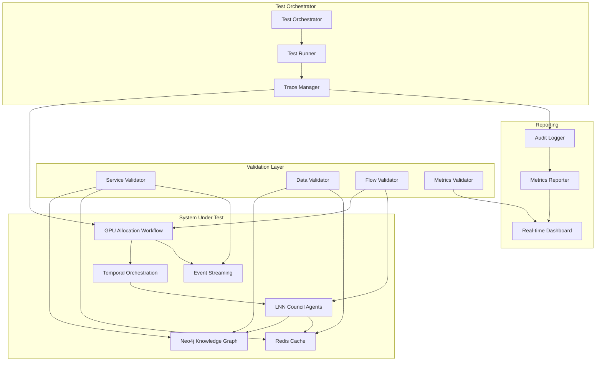

# Design Document

## Overview

The End-to-End Integration Testing system provides comprehensive validation of the AURA Intelligence platform by creating traceable workflows that connect all system components. This design leverages the existing architecture including GPU allocation workflows, LNN council agents, Neo4j knowledge graphs, Redis caching, and Docker Compose orchestration to create a unified testing framework.

The system addresses the critical gap between isolated component testing and production readiness by providing real-time visibility into data flow, component interactions, and system health across the entire platform.

## Architecture

### System Components Integration

The integration testing system connects these existing AURA Intelligence components:

**Core Workflows:**
- `core/src/aura_intelligence/workflows/gpu_allocation.py` - GPU resource allocation with Temporal orchestration
- `core/src/aura_intelligence/agents/council/lnn_council.py` - LNN-based multi-agent decision making

**Data Layer:**
- `core/src/aura_intelligence/adapters/neo4j_adapter.py` - Knowledge graph storage and retrieval
- `core/src/aura_intelligence/adapters/redis_adapter.py` - Context caching and session management

**Infrastructure:**
- `core/docker-compose.dev.yml` - Development environment orchestration
- `core/check_system_status.py` - Service health monitoring

### Integration Test Architecture



## Components and Interfaces

### 1. Integration Test Orchestrator

**Purpose:** Coordinates end-to-end test execution and manages test lifecycle.

**Key Classes:**
```python
class IntegrationTestOrchestrator:
    """Orchestrates comprehensive integration tests."""
    
    async def run_full_integration_test(
        self, 
        test_scenario: TestScenario
    ) -> IntegrationTestResult
    
    async def validate_system_readiness(self) -> SystemReadinessReport
    
    async def trace_request_flow(
        self, 
        request_id: str
    ) -> RequestFlowTrace
```

**Interfaces:**
- Extends existing `core/check_system_status.py` functionality
- Integrates with `GPUAllocationWorkflow` from existing codebase
- Uses `LNNCouncilAgent` for decision validation

### 2. Service Health Validator

**Purpose:** Validates all required services are running and accessible.

**Integration Points:**
- Docker Compose services from `core/docker-compose.dev.yml`
- Port connectivity validation (Neo4j:7687, Redis:6379, etc.)
- Service-specific health checks

**Key Methods:**
```python
class ServiceHealthValidator:
    async def validate_neo4j_connectivity(self) -> HealthStatus
    async def validate_redis_connectivity(self) -> HealthStatus  
    async def validate_temporal_connectivity(self) -> HealthStatus
    async def validate_kafka_connectivity(self) -> HealthStatus
```

### 3. Workflow Trace Manager

**Purpose:** Tracks requests through the complete system workflow.

**Integration with Existing Code:**
- Instruments `GPUAllocationWorkflow.run()` method
- Traces LNN council voting in `LNNCouncilAgent.process()`
- Monitors Neo4j operations via `Neo4jAdapter`
- Tracks Redis cache operations via `RedisAdapter`

**Trace Data Structure:**
```python
@dataclass
class WorkflowTrace:
    request_id: str
    start_time: datetime
    steps: List[TraceStep]
    current_step: Optional[str]
    completion_status: CompletionStatus
    
@dataclass  
class TraceStep:
    step_name: str
    component: str
    start_time: datetime
    end_time: Optional[datetime]
    input_data: Dict[str, Any]
    output_data: Optional[Dict[str, Any]]
    status: StepStatus
    error_details: Optional[str]
```

### 4. Data Flow Validator

**Purpose:** Validates data consistency across all storage systems.

**Validation Points:**
- GPU allocation decisions stored in Neo4j via `Neo4jAdapter.add_decision_node()`
- Context data cached in Redis via `RedisAdapter.cache_context_window()`
- Event publication to Kafka streams
- Temporal workflow state persistence

**Key Validations:**
```python
class DataFlowValidator:
    async def validate_decision_persistence(
        self, 
        allocation_id: str
    ) -> ValidationResult
    
    async def validate_context_caching(
        self, 
        agent_id: str, 
        context_id: str
    ) -> ValidationResult
    
    async def validate_event_propagation(
        self, 
        event_id: str
    ) -> ValidationResult
```

### 5. Real-time Test Dashboard

**Purpose:** Provides live visibility into test execution and system state.

**Features:**
- Real-time workflow progress visualization
- Component health status monitoring  
- Performance metrics display
- Error detection and alerting

**Integration:**
- Connects to existing Grafana instance (port 3000)
- Uses Prometheus metrics (port 9090)
- Displays Neo4j query performance
- Shows Redis cache hit rates

## Data Models

### Test Scenario Definition

```python
@dataclass
class TestScenario:
    scenario_id: str
    name: str
    description: str
    
    # Test parameters
    gpu_requests: List[GPUAllocationRequest]
    expected_outcomes: List[ExpectedOutcome]
    validation_rules: List[ValidationRule]
    
    # Timing constraints
    max_execution_time: timedelta
    step_timeouts: Dict[str, timedelta]
    
    # Environment requirements
    required_services: List[str]
    feature_flags: Dict[str, bool]

@dataclass
class IntegrationTestResult:
    test_id: str
    scenario: TestScenario
    start_time: datetime
    end_time: datetime
    
    # Results
    overall_status: TestStatus
    step_results: List[StepResult]
    performance_metrics: PerformanceMetrics
    
    # Validation outcomes
    service_health: Dict[str, HealthStatus]
    data_consistency: Dict[str, ValidationResult]
    workflow_traces: List[WorkflowTrace]
    
    # Reporting
    summary_report: str
    detailed_logs: List[LogEntry]
    recommendations: List[str]
```

### System State Tracking

```python
@dataclass
class SystemState:
    timestamp: datetime
    
    # Service states
    services: Dict[str, ServiceState]
    
    # Resource utilization
    neo4j_metrics: Neo4jMetrics
    redis_metrics: RedisMetrics
    temporal_metrics: TemporalMetrics
    
    # Active workflows
    active_allocations: List[str]
    pending_decisions: List[str]
    
    # Performance indicators
    response_times: Dict[str, float]
    error_rates: Dict[str, float]
    throughput: Dict[str, float]
```

## Error Handling

### Error Classification

**Service Errors:**
- Connection failures to Neo4j, Redis, Kafka, Temporal
- Service unavailability or timeout
- Authentication/authorization failures

**Workflow Errors:**
- GPU allocation failures
- LNN council consensus failures  
- Decision persistence failures
- Event publication failures

**Data Consistency Errors:**
- Missing data in expected storage systems
- Data corruption or serialization issues
- Cache invalidation problems
- Transaction rollback scenarios

### Error Recovery Strategies

**Automatic Recovery:**
```python
class ErrorRecoveryManager:
    async def handle_service_failure(
        self, 
        service: str, 
        error: Exception
    ) -> RecoveryAction
    
    async def handle_workflow_failure(
        self, 
        workflow_id: str, 
        step: str, 
        error: Exception
    ) -> RecoveryAction
    
    async def handle_data_inconsistency(
        self, 
        validation_error: ValidationError
    ) -> RecoveryAction
```

**Fallback Mechanisms:**
- Service health checks with retry logic
- Alternative data retrieval paths
- Graceful degradation for non-critical components
- Test continuation with partial functionality

## Testing Strategy

### Test Categories

**1. Smoke Tests**
- Basic service connectivity
- Essential workflow execution
- Critical data path validation
- ~5 minute execution time

**2. Integration Tests**  
- Complete GPU allocation workflow
- Multi-agent council decision making
- Cross-component data consistency
- ~15 minute execution time

**3. End-to-End Tests**
- Full system workflow with real data
- Performance under load
- Error recovery validation
- ~30 minute execution time

**4. Chaos Tests**
- Service failure simulation
- Network partition handling
- Resource exhaustion scenarios
- ~45 minute execution time

### Test Execution Framework

```python
class IntegrationTestSuite:
    def __init__(self, config: TestConfig):
        self.orchestrator = IntegrationTestOrchestrator(config)
        self.validator = SystemValidator(config)
        self.reporter = TestReporter(config)
    
    async def run_smoke_tests(self) -> TestSuiteResult
    async def run_integration_tests(self) -> TestSuiteResult  
    async def run_end_to_end_tests(self) -> TestSuiteResult
    async def run_chaos_tests(self) -> TestSuiteResult
    
    async def run_all_tests(self) -> ComprehensiveTestResult
```

### Continuous Validation

**Pre-deployment Validation:**
- Automated test execution on code changes
- Performance regression detection
- Integration point verification

**Runtime Monitoring:**
- Continuous health checks
- Performance metric tracking
- Anomaly detection and alerting

**Post-deployment Validation:**
- Production smoke tests
- Canary deployment validation
- Rollback verification

## Implementation Phases

### Phase 1: Foundation (Week 1)
- Extend `core/check_system_status.py` with comprehensive service validation
- Create basic workflow tracing for `GPUAllocationWorkflow`
- Implement simple data consistency checks
- Set up test result reporting

### Phase 2: Core Integration (Week 2)  
- Implement full workflow tracing through LNN council agents
- Add Neo4j and Redis data validation
- Create real-time test dashboard
- Integrate with existing Grafana/Prometheus monitoring

### Phase 3: Advanced Features (Week 3)
- Add chaos testing capabilities
- Implement performance benchmarking
- Create automated test scheduling
- Add comprehensive error recovery

### Phase 4: Production Readiness (Week 4)
- Integrate with CI/CD pipeline
- Add production monitoring hooks
- Create operational runbooks
- Implement alerting and escalation

This design ensures that the integration testing system builds upon and enhances the existing AURA Intelligence architecture while providing comprehensive validation of system behavior and performance.