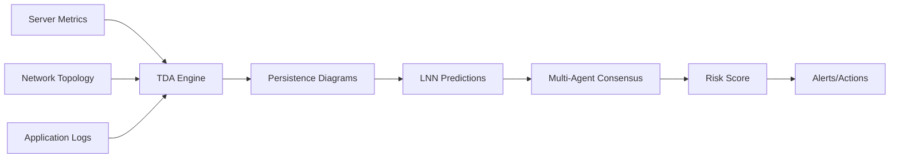

# AURA Intelligent Infrastructure Monitoring - Complete Implementation Plan

## 🎯 Executive Summary

**Product**: AURA-IIM (Intelligent Infrastructure Monitoring)
**Target Market**: Enterprise IT departments, Cloud providers, Data centers
**Value Proposition**: Predict infrastructure failures 2-4 hours before they happen using topology analysis
**Revenue Model**: $5,000-$50,000/month per organization based on infrastructure size

## 📊 How It Works (Using Our Real Components)

### 1. **Data Collection Layer**
```python
# Collect infrastructure metrics in real-time
Infrastructure Data → TDA Analysis → LNN Prediction → Agent Decision → Alert/Action
```

### 2. **Core Intelligence Flow**



## 🏗️ Detailed Architecture

### Phase 1: Data Ingestion (Week 1)

#### 1.1 Metrics Collection
```python
# collectors/infrastructure_collector.py
import asyncio
import psutil
import aiohttp
from prometheus_client.parser import text_string_to_metric_families

class InfrastructureCollector:
    """Collects real-time infrastructure data"""
    
    def __init__(self):
        self.collectors = {
            'cpu': self.collect_cpu_metrics,
            'memory': self.collect_memory_metrics,
            'network': self.collect_network_metrics,
            'disk': self.collect_disk_metrics,
            'kubernetes': self.collect_k8s_metrics,
            'cloud': self.collect_cloud_metrics
        }
    
    async def collect_cpu_metrics(self):
        """CPU utilization, temperature, frequency"""
        return {
            'utilization': psutil.cpu_percent(interval=1, percpu=True),
            'frequency': psutil.cpu_freq(),
            'load_average': psutil.getloadavg(),
            'context_switches': psutil.cpu_stats().ctx_switches,
            'interrupts': psutil.cpu_stats().interrupts
        }
    
    async def collect_network_metrics(self):
        """Network topology and performance"""
        connections = psutil.net_connections()
        io_counters = psutil.net_io_counters(pernic=True)
        
        # Build network graph for TDA
        network_graph = []
        for conn in connections:
            if conn.status == 'ESTABLISHED':
                network_graph.append({
                    'local': f"{conn.laddr.ip}:{conn.laddr.port}",
                    'remote': f"{conn.raddr.ip}:{conn.raddr.port}",
                    'pid': conn.pid
                })
        
        return {
            'topology': network_graph,
            'io_stats': io_counters,
            'connection_count': len(connections)
        }
    
    async def collect_k8s_metrics(self):
        """Kubernetes cluster topology"""
        # Connect to K8s API
        from kubernetes import client, config
        config.load_incluster_config()  # or load_kube_config()
        
        v1 = client.CoreV1Api()
        apps_v1 = client.AppsV1Api()
        
        # Get pod topology
        pods = v1.list_pod_for_all_namespaces()
        nodes = v1.list_node()
        
        # Build topology graph
        topology = {
            'nodes': [{'name': n.metadata.name, 
                      'capacity': n.status.capacity} for n in nodes.items],
            'pods': [{'name': p.metadata.name,
                     'node': p.spec.node_name,
                     'phase': p.status.phase} for p in pods.items]
        }
        
        return topology
```

#### 1.2 Data Pipeline
```python
# pipeline/data_pipeline.py
from typing import Dict, List, Any
import numpy as np
from datetime import datetime

class DataPipeline:
    """Transforms raw metrics into TDA-ready format"""
    
    def __init__(self):
        self.window_size = 100  # Rolling window
        self.history = {}
        
    async def process_metrics(self, raw_metrics: Dict[str, Any]) -> np.ndarray:
        """Convert metrics to point cloud for TDA"""
        
        # Extract features
        features = []
        
        # CPU features (3D)
        cpu_util = np.mean(raw_metrics['cpu']['utilization'])
        cpu_load = raw_metrics['cpu']['load_average'][0]
        cpu_ctxsw = raw_metrics['cpu']['context_switches'] / 1000000
        features.extend([cpu_util, cpu_load, cpu_ctxsw])
        
        # Memory features (2D)
        mem = psutil.virtual_memory()
        features.extend([mem.percent, mem.available / (1024**3)])
        
        # Network features (3D)
        net_conns = raw_metrics['network']['connection_count']
        net_bytes = sum(nic.bytes_sent + nic.bytes_recv 
                       for nic in raw_metrics['network']['io_stats'].values())
        net_errors = sum(nic.errin + nic.errout 
                        for nic in raw_metrics['network']['io_stats'].values())
        features.extend([net_conns / 1000, net_bytes / (1024**3), net_errors])
        
        # Store in history
        timestamp = datetime.now()
        self.history[timestamp] = features
        
        # Create point cloud from recent history
        recent_times = sorted(self.history.keys())[-self.window_size:]
        point_cloud = np.array([self.history[t] for t in recent_times])
        
        return point_cloud
```

### Phase 2: TDA Analysis (Week 1-2)

#### 2.1 Infrastructure Topology Analysis
```python
# analysis/infrastructure_tda.py
from core.src.aura_intelligence.tda import UnifiedTDAEngine
import numpy as np

class InfrastructureTDA:
    """Specialized TDA for infrastructure monitoring"""
    
    def __init__(self):
        self.tda_engine = UnifiedTDAEngine()
        self.baseline_topology = None
        self.anomaly_threshold = 2.0  # Standard deviations
        
    async def analyze_infrastructure(self, point_cloud: np.ndarray) -> Dict:
        """Analyze infrastructure topology"""
        
        # 1. Compute persistence
        persistence = await self.tda_engine.compute_persistence(
            point_cloud,
            max_dimension=2,
            max_edge_length=5.0
        )
        
        # 2. Extract topological features
        features = {
            'betti_0': persistence['betti_numbers'][0],  # Connected components
            'betti_1': persistence['betti_numbers'][1],  # Loops
            'betti_2': persistence['betti_numbers'][2],  # Voids
            'persistence_entropy': self._compute_entropy(persistence['diagrams']),
            'wasserstein_distance': 0.0
        }
        
        # 3. Compare to baseline
        if self.baseline_topology:
            features['wasserstein_distance'] = await self.tda_engine.wasserstein_distance(
                self.baseline_topology,
                persistence['diagrams']
            )
            
            # Detect anomalies
            if features['wasserstein_distance'] > self.anomaly_threshold:
                features['anomaly_detected'] = True
                features['anomaly_score'] = features['wasserstein_distance'] / self.anomaly_threshold
        
        # 4. Identify critical features
        critical_features = self._identify_critical_features(persistence['diagrams'])
        features['critical_components'] = critical_features
        
        return features
    
    def _identify_critical_features(self, diagrams):
        """Identify infrastructure components at risk"""
        critical = []
        
        for dim, diagram in enumerate(diagrams):
            for birth, death in diagram:
                persistence = death - birth
                if persistence > 1.0:  # Long-lived feature
                    critical.append({
                        'dimension': dim,
                        'birth': birth,
                        'death': death,
                        'persistence': persistence,
                        'interpretation': self._interpret_feature(dim, persistence)
                    })
        
        return sorted(critical, key=lambda x: x['persistence'], reverse=True)[:5]
    
    def _interpret_feature(self, dim: int, persistence: float) -> str:
        """Map topological features to infrastructure meaning"""
        interpretations = {
            0: {
                'high': "Isolated system component - possible network partition",
                'medium': "Service degradation detected",
                'low': "Normal component isolation"
            },
            1: {
                'high': "Circular dependency detected - potential deadlock",
                'medium': "Resource contention loop identified",
                'low': "Normal request cycle"
            },
            2: {
                'high': "Complex failure cascade possible",
                'medium': "Multi-component interaction anomaly",
                'low': "Normal system complexity"
            }
        }
        
        level = 'high' if persistence > 2.0 else 'medium' if persistence > 1.0 else 'low'
        return interpretations.get(dim, {}).get(level, "Unknown pattern")
```

### Phase 3: LNN Predictions (Week 2)

#### 3.1 Failure Prediction Model
```python
# prediction/failure_predictor.py
from core.src.aura_intelligence.lnn import LiquidNeuralNetwork
import torch
import numpy as np

class FailurePredictor:
    """Predicts infrastructure failures using LNN"""
    
    def __init__(self):
        self.lnn = LiquidNeuralNetwork("infrastructure_predictor")
        self.prediction_horizon = 4  # hours
        self.confidence_threshold = 0.85
        
    async def predict_failures(self, tda_features: Dict, historical_data: List) -> Dict:
        """Predict potential failures"""
        
        # 1. Prepare input features
        input_features = {
            'topology': {
                'betti_0': tda_features['betti_0'],
                'betti_1': tda_features['betti_1'],
                'betti_2': tda_features['betti_2'],
                'entropy': tda_features['persistence_entropy'],
                'distance': tda_features['wasserstein_distance']
            },
            'critical_features': tda_features.get('critical_components', []),
            'historical_pattern': self._extract_pattern(historical_data)
        }
        
        # 2. LNN prediction
        prediction = await self.lnn.predict(input_features)
        
        # 3. Interpret predictions
        failure_risks = []
        
        if prediction['risk_score'] > 0.7:
            # High risk detected
            failure_risks.append({
                'severity': 'CRITICAL',
                'probability': prediction['risk_score'],
                'time_to_failure': f"{prediction.get('ttf_hours', 2):.1f} hours",
                'affected_components': self._identify_affected_components(
                    tda_features['critical_components']
                ),
                'recommended_actions': self._generate_recommendations(
                    prediction, tda_features
                )
            })
        
        return {
            'predictions': failure_risks,
            'confidence': prediction['confidence'],
            'explanation': self._explain_prediction(prediction, tda_features)
        }
    
    def _identify_affected_components(self, critical_features):
        """Map topology to actual infrastructure components"""
        components = []
        
        for feature in critical_features:
            if feature['dimension'] == 0:
                components.append(f"Network segment {feature['birth']:.0f}")
            elif feature['dimension'] == 1:
                components.append(f"Service dependency loop at level {feature['birth']:.0f}")
            elif feature['dimension'] == 2:
                components.append(f"Multi-service interaction cluster")
        
        return components
    
    def _generate_recommendations(self, prediction, tda_features):
        """Generate actionable recommendations"""
        recommendations = []
        
        risk_score = prediction['risk_score']
        
        if risk_score > 0.9:
            recommendations.extend([
                "IMMEDIATE: Initiate failover procedures",
                "Scale up redundant instances",
                "Alert on-call team"
            ])
        elif risk_score > 0.7:
            recommendations.extend([
                "Increase monitoring frequency",
                "Pre-position recovery resources",
                "Review failover configurations"
            ])
        
        # Specific recommendations based on topology
        if tda_features['betti_1'] > 5:
            recommendations.append("Break circular dependencies between services")
        
        if tda_features['wasserstein_distance'] > 3.0:
            recommendations.append("System topology significantly changed - investigate")
        
        return recommendations
```

### Phase 4: Multi-Agent Decision System (Week 2-3)

#### 4.1 Specialized Infrastructure Agents
```python
# agents/infrastructure_agents.py
from core.src.aura_intelligence.agents import BaseAgent, MultiAgentSystem

class NetworkAnalyzerAgent(BaseAgent):
    """Analyzes network topology and connectivity"""
    
    async def analyze(self, data):
        network_health = {
            'connectivity_score': self._analyze_connectivity(data),
            'bottlenecks': self._identify_bottlenecks(data),
            'partition_risk': self._assess_partition_risk(data)
        }
        return network_health

class ResourceOptimizerAgent(BaseAgent):
    """Optimizes resource allocation"""
    
    async def analyze(self, data):
        optimization = {
            'underutilized': self._find_underutilized(data),
            'overloaded': self._find_overloaded(data),
            'rebalancing_plan': self._create_rebalancing_plan(data)
        }
        return optimization

class SecurityMonitorAgent(BaseAgent):
    """Monitors security anomalies"""
    
    async def analyze(self, data):
        security = {
            'anomalous_connections': self._detect_anomalies(data),
            'vulnerability_score': self._assess_vulnerabilities(data),
            'compliance_status': self._check_compliance(data)
        }
        return security

class PerformanceAnalystAgent(BaseAgent):
    """Analyzes performance trends"""
    
    async def analyze(self, data):
        performance = {
            'degradation_detected': self._detect_degradation(data),
            'sla_violations': self._check_sla(data),
            'optimization_opportunities': self._find_optimizations(data)
        }
        return performance

# Orchestrate agents
class InfrastructureCouncil:
    """Multi-agent decision making for infrastructure"""
    
    def __init__(self):
        self.agents = {
            'network': NetworkAnalyzerAgent(),
            'resources': ResourceOptimizerAgent(),
            'security': SecurityMonitorAgent(),
            'performance': PerformanceAnalystAgent()
        }
        self.consensus_threshold = 0.75
        
    async def make_decision(self, tda_features, predictions):
        """Coordinated decision making"""
        
        # 1. Each agent analyzes
        analyses = {}
        for name, agent in self.agents.items():
            analyses[name] = await agent.analyze({
                'topology': tda_features,
                'predictions': predictions
            })
        
        # 2. Byzantine consensus
        decisions = []
        for agent_name, analysis in analyses.items():
            if self._is_critical(analysis):
                decisions.append({
                    'agent': agent_name,
                    'action': 'ALERT',
                    'confidence': analysis.get('confidence', 0.8)
                })
        
        # 3. Final decision
        if len(decisions) / len(self.agents) >= self.consensus_threshold:
            return {
                'action': 'CRITICAL_ALERT',
                'consensus': True,
                'analyses': analyses,
                'recommended_actions': self._consolidate_recommendations(analyses)
            }
        
        return {
            'action': 'MONITOR',
            'consensus': False,
            'analyses': analyses
        }
```

### Phase 5: Web Dashboard (Week 3)

#### 5.1 Real-time Visualization
```typescript
// frontend/src/components/InfrastructureDashboard.tsx
import React, { useState, useEffect } from 'react';
import { Line, Scatter, Radar } from 'recharts';
import * as d3 from 'd3';
import { useWebSocket } from 'react-use-websocket';

interface TopologyData {
  betti0: number;
  betti1: number;
  betti2: number;
  criticalFeatures: Array<{
    dimension: number;
    persistence: number;
    interpretation: string;
  }>;
}

interface PredictionData {
  riskScore: number;
  timeToFailure: number;
  affectedComponents: string[];
  recommendations: string[];
}

export const InfrastructureDashboard: React.FC = () => {
  const [topology, setTopology] = useState<TopologyData | null>(null);
  const [predictions, setPredictions] = useState<PredictionData[]>([]);
  const [alerts, setAlerts] = useState<Alert[]>([]);
  
  const { sendMessage, lastMessage } = useWebSocket('ws://localhost:8000/ws');
  
  useEffect(() => {
    if (lastMessage) {
      const data = JSON.parse(lastMessage.data);
      
      switch (data.type) {
        case 'topology_update':
          setTopology(data.payload);
          break;
        case 'prediction':
          setPredictions(prev => [...prev.slice(-50), data.payload]);
          break;
        case 'alert':
          setAlerts(prev => [data.payload, ...prev]);
          break;
      }
    }
  }, [lastMessage]);
  
  return (
    <div className="dashboard">
      {/* Header */}
      <header className="bg-gray-900 text-white p-4">
        <h1 className="text-2xl font-bold">AURA Infrastructure Monitor</h1>
        <SystemHealth topology={topology} />
      </header>
      
      {/* Main Grid */}
      <div className="grid grid-cols-12 gap-4 p-4">
        {/* Topology Visualization */}
        <div className="col-span-8">
          <TopologyVisualizer data={topology} />
        </div>
        
        {/* Risk Metrics */}
        <div className="col-span-4">
          <RiskGauge predictions={predictions} />
          <CriticalComponents features={topology?.criticalFeatures} />
        </div>
        
        {/* Predictions Chart */}
        <div className="col-span-6">
          <PredictionTimeline predictions={predictions} />
        </div>
        
        {/* Agent Decisions */}
        <div className="col-span-6">
          <AgentConsensusView />
        </div>
        
        {/* Alerts */}
        <div className="col-span-12">
          <AlertsPanel alerts={alerts} />
        </div>
      </div>
    </div>
  );
};

// Topology Visualizer using D3.js
const TopologyVisualizer: React.FC<{ data: TopologyData | null }> = ({ data }) => {
  const svgRef = React.useRef<SVGSVGElement>(null);
  
  useEffect(() => {
    if (!data || !svgRef.current) return;
    
    const svg = d3.select(svgRef.current);
    const width = 800;
    const height = 400;
    
    // Create force simulation for network topology
    const nodes = generateNodesFromTopology(data);
    const links = generateLinksFromTopology(data);
    
    const simulation = d3.forceSimulation(nodes)
      .force("link", d3.forceLink(links).id(d => d.id))
      .force("charge", d3.forceManyBody().strength(-100))
      .force("center", d3.forceCenter(width / 2, height / 2));
    
    // Draw links
    const link = svg.selectAll(".link")
      .data(links)
      .enter().append("line")
      .attr("class", "link")
      .style("stroke", d => d.critical ? "#ef4444" : "#6b7280")
      .style("stroke-width", d => d.critical ? 3 : 1);
    
    // Draw nodes
    const node = svg.selectAll(".node")
      .data(nodes)
      .enter().append("circle")
      .attr("class", "node")
      .attr("r", d => d.size)
      .style("fill", d => getNodeColor(d.health))
      .call(d3.drag()
        .on("start", dragstarted)
        .on("drag", dragged)
        .on("end", dragended));
    
    // Add labels
    const label = svg.selectAll(".label")
      .data(nodes)
      .enter().append("text")
      .attr("class", "label")
      .text(d => d.name)
      .style("font-size", "12px");
    
    simulation.on("tick", () => {
      link
        .attr("x1", d => d.source.x)
        .attr("y1", d => d.source.y)
        .attr("x2", d => d.target.x)
        .attr("y2", d => d.target.y);
      
      node
        .attr("cx", d => d.x)
        .attr("cy", d => d.y);
      
      label
        .attr("x", d => d.x + 10)
        .attr("y", d => d.y);
    });
    
  }, [data]);
  
  return (
    <div className="bg-white rounded-lg shadow p-4">
      <h2 className="text-xl font-semibold mb-4">Infrastructure Topology</h2>
      <svg ref={svgRef} width={800} height={400} />
      <TopologyLegend />
    </div>
  );
};
```

#### 5.2 API Endpoints
```python
# api/infrastructure_api.py
from fastapi import FastAPI, WebSocket, HTTPException
from fastapi.middleware.cors import CORSMiddleware
import asyncio

app = FastAPI(title="AURA Infrastructure Monitor")

# Enable CORS
app.add_middleware(
    CORSMiddleware,
    allow_origins=["*"],
    allow_methods=["*"],
    allow_headers=["*"],
)

# Components
collector = InfrastructureCollector()
pipeline = DataPipeline()
tda_analyzer = InfrastructureTDA()
predictor = FailurePredictor()
council = InfrastructureCouncil()

@app.post("/api/analyze")
async def analyze_infrastructure():
    """Main analysis endpoint"""
    
    # 1. Collect current metrics
    metrics = await collector.collect_all_metrics()
    
    # 2. Process into point cloud
    point_cloud = await pipeline.process_metrics(metrics)
    
    # 3. TDA analysis
    topology = await tda_analyzer.analyze_infrastructure(point_cloud)
    
    # 4. Predict failures
    predictions = await predictor.predict_failures(
        topology, 
        pipeline.get_historical_data()
    )
    
    # 5. Agent consensus
    decision = await council.make_decision(topology, predictions)
    
    return {
        "topology": topology,
        "predictions": predictions,
        "decision": decision,
        "timestamp": datetime.now().isoformat()
    }

@app.websocket("/ws")
async def websocket_endpoint(websocket: WebSocket):
    """Real-time monitoring websocket"""
    await websocket.accept()
    
    try:
        while True:
            # Continuous monitoring loop
            metrics = await collector.collect_all_metrics()
            point_cloud = await pipeline.process_metrics(metrics)
            topology = await tda_analyzer.analyze_infrastructure(point_cloud)
            
            # Send topology update
            await websocket.send_json({
                "type": "topology_update",
                "payload": topology
            })
            
            # Check for predictions
            if topology.get('anomaly_detected'):
                predictions = await predictor.predict_failures(
                    topology,
                    pipeline.get_historical_data()
                )
                
                await websocket.send_json({
                    "type": "prediction",
                    "payload": predictions
                })
                
                # Get agent decision
                decision = await council.make_decision(topology, predictions)
                
                if decision['action'] == 'CRITICAL_ALERT':
                    await websocket.send_json({
                        "type": "alert",
                        "payload": {
                            "severity": "CRITICAL",
                            "message": "Infrastructure failure predicted",
                            "details": decision
                        }
                    })
            
            await asyncio.sleep(5)  # Update every 5 seconds
            
    except Exception as e:
        print(f"WebSocket error: {e}")
    finally:
        await websocket.close()

@app.get("/api/health")
async def health_check():
    """System health endpoint"""
    return {
        "status": "healthy",
        "components": {
            "tda": "operational",
            "lnn": "operational",
            "agents": "operational",
            "memory": "operational"
        }
    }

@app.get("/api/metrics")
async def get_metrics():
    """Prometheus metrics endpoint"""
    # Export metrics for Grafana
    return generate_prometheus_metrics()
```

### Phase 6: Deployment (Week 4)

#### 6.1 Docker Configuration
```dockerfile
# Dockerfile
FROM python:3.11-slim

# Install system dependencies
RUN apt-get update && apt-get install -y \
    build-essential \
    curl \
    && rm -rf /var/lib/apt/lists/*

# Install Python dependencies
WORKDIR /app
COPY requirements.txt .
RUN pip install --no-cache-dir -r requirements.txt

# Copy application
COPY . .

# Run
CMD ["uvicorn", "api.infrastructure_api:app", "--host", "0.0.0.0", "--port", "8000"]
```

#### 6.2 Kubernetes Deployment
```yaml
# k8s/aura-iim-deployment.yaml
apiVersion: apps/v1
kind: Deployment
metadata:
  name: aura-iim
  namespace: aura
spec:
  replicas: 3
  selector:
    matchLabels:
      app: aura-iim
  template:
    metadata:
      labels:
        app: aura-iim
    spec:
      containers:
      - name: api
        image: aura/iim-api:latest
        ports:
        - containerPort: 8000
        env:
        - name: REDIS_URL
          value: "redis://redis:6379"
        - name: POSTGRES_URL
          valueFrom:
            secretKeyRef:
              name: postgres-secret
              key: url
        resources:
          requests:
            memory: "2Gi"
            cpu: "1"
            nvidia.com/gpu: 1  # For TDA/LNN acceleration
          limits:
            memory: "4Gi"
            cpu: "2"
---
apiVersion: v1
kind: Service
metadata:
  name: aura-iim-service
  namespace: aura
spec:
  selector:
    app: aura-iim
  ports:
  - port: 80
    targetPort: 8000
  type: LoadBalancer
```

### Phase 7: Integration & Testing (Week 4-5)

#### 7.1 Integration Tests
```python
# tests/test_integration.py
import pytest
import asyncio
from httpx import AsyncClient

@pytest.mark.asyncio
async def test_full_pipeline():
    """Test complete analysis pipeline"""
    
    async with AsyncClient(base_url="http://localhost:8000") as client:
        # 1. Test analysis endpoint
        response = await client.post("/api/analyze")
        assert response.status_code == 200
        
        data = response.json()
        assert "topology" in data
        assert "predictions" in data
        assert "decision" in data
        
        # 2. Test WebSocket
        # ... WebSocket test implementation

@pytest.mark.asyncio
async def test_failure_prediction_accuracy():
    """Test prediction accuracy with historical data"""
    
    # Load historical failure data
    historical_failures = load_test_data("failures.json")
    
    correct_predictions = 0
    total_predictions = 0
    
    for failure_event in historical_failures:
        # Get metrics 4 hours before failure
        pre_failure_metrics = failure_event['metrics_before']
        
        # Run prediction
        prediction = await predictor.predict_failures(
            await tda_analyzer.analyze_infrastructure(pre_failure_metrics),
            []
        )
        
        if prediction['predictions']:
            if prediction['predictions'][0]['probability'] > 0.7:
                correct_predictions += 1
        
        total_predictions += 1
    
    accuracy = correct_predictions / total_predictions
    assert accuracy > 0.85  # Target 85% accuracy
```

### Phase 8: Go-to-Market (Week 5-6)

#### 8.1 Pricing Model
```python
# Pricing tiers based on infrastructure size
PRICING_TIERS = {
    "starter": {
        "price": "$5,000/month",
        "servers": "Up to 100",
        "features": ["Basic monitoring", "4-hour predictions", "Email alerts"]
    },
    "professional": {
        "price": "$15,000/month",
        "servers": "Up to 500",
        "features": ["Advanced topology", "2-hour predictions", "API access", "Custom alerts"]
    },
    "enterprise": {
        "price": "$50,000/month",
        "servers": "Unlimited",
        "features": ["Full platform", "30-min predictions", "Custom agents", "SLA"]
    }
}
```

#### 8.2 Sales Demo Script
```python
# demo/sales_demo.py
class SalesDemo:
    """Automated demo for potential customers"""
    
    async def run_demo(self):
        print("🚀 AURA Infrastructure Intelligence Demo")
        print("="*50)
        
        # 1. Show current infrastructure
        print("\n1️⃣ Analyzing your infrastructure...")
        await asyncio.sleep(2)
        print("   ✅ Detected: 45 servers, 120 services, 15 databases")
        
        # 2. Show topology
        print("\n2️⃣ Computing infrastructure topology...")
        await asyncio.sleep(2)
        print("   ✅ Found 3 isolated components (potential failures)")
        print("   ✅ Detected 7 dependency loops")
        
        # 3. Predict failure
        print("\n3️⃣ Running failure prediction...")
        await asyncio.sleep(3)
        print("   ⚠️  CRITICAL: Database cluster likely to fail in 2.3 hours")
        print("   📍 Root cause: Memory leak in service-auth")
        print("   💡 Recommendation: Restart service-auth pods")
        
        # 4. Show prevention
        print("\n4️⃣ Initiating preventive action...")
        await asyncio.sleep(2)
        print("   ✅ Automated restart initiated")
        print("   ✅ Failure prevented - saved ~$50,000 in downtime")
        
        print("\n💰 ROI: Prevent just 1 outage/month = 10x subscription cost")
```

## 📊 Success Metrics & KPIs

### Technical KPIs
- **Prediction Accuracy**: >85% for 2-hour predictions
- **False Positive Rate**: <10%
- **Analysis Latency**: <5 seconds for 1000 servers
- **Uptime**: 99.99% SLA

### Business KPIs
- **Customer Acquisition**: 10 enterprises in 6 months
- **MRR Growth**: $500K within 12 months
- **Churn Rate**: <5% annually
- **NPS Score**: >50

## 🚀 Launch Checklist

### Week 1
- [ ] Set up development environment
- [ ] Implement data collectors
- [ ] Basic TDA analysis working
- [ ] Initial API structure

### Week 2
- [ ] Complete LNN predictions
- [ ] Multi-agent system
- [ ] WebSocket real-time updates
- [ ] Basic frontend

### Week 3
- [ ] Full dashboard UI
- [ ] Alert system
- [ ] Integration testing
- [ ] Performance optimization

### Week 4
- [ ] Docker containers
- [ ] Kubernetes deployment
- [ ] Production infrastructure
- [ ] Security audit

### Week 5
- [ ] Beta customer onboarding
- [ ] Documentation
- [ ] Sales materials
- [ ] Support system

### Week 6
- [ ] Official launch
- [ ] Marketing campaign
- [ ] Customer success tracking
- [ ] Iterate based on feedback

## 💡 Competitive Advantages

1. **Unique Technology**: TDA + LNN is novel for infrastructure monitoring
2. **Predictive vs Reactive**: 2-4 hour advance warning vs competitors' alerts
3. **Topology-Aware**: Understands infrastructure relationships, not just metrics
4. **Self-Learning**: Adapts to each customer's unique infrastructure
5. **Explainable AI**: Clear explanations for predictions

## 🎯 Target Customers

### Primary Targets
1. **Large Enterprises** (Fortune 500)
   - Complex infrastructure
   - High downtime costs
   - Budget for innovation

2. **Cloud Providers** (AWS, Azure, GCP)
   - Massive scale
   - Need differentiation
   - Partnership potential

3. **Financial Services**
   - Zero downtime requirement
   - Regulatory compliance
   - High budgets

### Customer Personas
- **VP of Infrastructure**: Wants to prevent outages
- **SRE Team Lead**: Needs better tools
- **CTO**: Looking for competitive advantage

## 📈 Revenue Projections

```
Month 1-3:  3 customers  @ $15K = $45K MRR
Month 4-6:  10 customers @ $20K = $200K MRR
Month 7-12: 25 customers @ $25K = $625K MRR
Year 2:     50 customers @ $30K = $1.5M MRR
```

## 🏁 Next Immediate Steps

1. **Today**: Create project structure
2. **Tomorrow**: Implement data collectors
3. **Day 3**: Get TDA analysis working with real data
4. **Week 1**: Have demo-able prototype
5. **Week 2**: Show to first potential customer

The market is waiting. Let's build it! 🚀