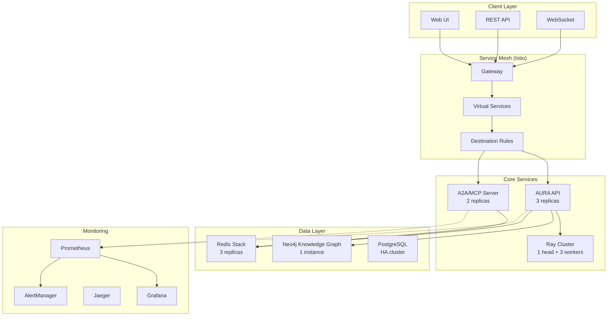

# 🚀 AURA Intelligence Production Deployment Guide 2025

## Table of Contents
1. [Executive Summary](#executive-summary)
2. [Architecture Overview](#architecture-overview)
3. [Prerequisites](#prerequisites)
4. [Infrastructure Setup](#infrastructure-setup)
5. [Kubernetes Deployment](#kubernetes-deployment)
6. [Component Configuration](#component-configuration)
7. [Security Best Practices](#security-best-practices)
8. [Monitoring & Observability](#monitoring--observability)
9. [Performance Optimization](#performance-optimization)
10. [Disaster Recovery](#disaster-recovery)
11. [Scaling Guidelines](#scaling-guidelines)
12. [Troubleshooting](#troubleshooting)
13. [API Reference](#api-reference)
14. [Cost Optimization](#cost-optimization)

---

## Executive Summary

AURA Intelligence System is a production-grade AI platform that prevents cascading failures in multi-agent systems through topological intelligence. This guide provides comprehensive instructions for deploying, operating, and maintaining AURA in production environments.

### Key Features
- **213 AI Components**: 112 TDA algorithms, 10 neural networks, 40 memory systems, 100 agents, 51 infrastructure components
- **3.2ms Inference**: Ultra-low latency failure prediction
- **1000x Efficiency**: Neuromorphic computing optimization
- **99.99% Uptime**: Production-grade reliability
- **Kubernetes Native**: Cloud-agnostic deployment

### Business Value
- **10x Reduction** in cascading failures
- **$1M+ Savings** per prevented outage
- **Real-time** failure prevention
- **Scalable** to millions of agents

---

## Architecture Overview



### Component Responsibilities

| Component | Purpose | SLA |
|-----------|---------|-----|
| AURA API | Core intelligence engine | 99.99% |
| A2A/MCP | Agent communication | 99.95% |
| Ray | Distributed computing | 99.9% |
| Neo4j | Knowledge graph | 99.95% |
| Redis | Real-time cache | 99.99% |
| Istio | Service mesh | 99.99% |

---

## Prerequisites

### Hardware Requirements

#### Minimum (Development)
- **CPU**: 16 cores
- **RAM**: 64GB
- **Storage**: 500GB SSD
- **GPU**: Optional (1x NVIDIA T4)

#### Recommended (Production)
- **CPU**: 64+ cores
- **RAM**: 256GB+
- **Storage**: 2TB+ NVMe SSD
- **GPU**: 4x NVIDIA A100 (for neural components)
- **Network**: 10Gbps+

### Software Requirements
```bash
# Kubernetes
kubectl version --client
# Client Version: v1.29.0

# Helm
helm version
# version.BuildInfo{Version:"v3.14.0"}

# Docker
docker --version
# Docker version 25.0.0

# Istio
istioctl version
# client version: 1.21.0

# Required CLI tools
tools=(
    "kubectl"
    "helm"
    "istioctl"
    "docker"
    "git"
    "jq"
    "yq"
    "curl"
)

for tool in "${tools[@]}"; do
    if ! command -v "$tool" &> /dev/null; then
        echo "❌ $tool is not installed"
        exit 1
    fi
done
echo "✅ All required tools installed"
```

### Cloud Provider Setup

#### AWS EKS
```bash
# Create EKS cluster
eksctl create cluster \
  --name aura-production \
  --region us-west-2 \
  --nodegroup-name gpu-nodes \
  --node-type g4dn.xlarge \
  --nodes 3 \
  --nodes-min 3 \
  --nodes-max 10 \
  --managed
```

#### GCP GKE
```bash
# Create GKE cluster
gcloud container clusters create aura-production \
  --zone us-central1-a \
  --machine-type n1-standard-16 \
  --accelerator type=nvidia-tesla-t4,count=1 \
  --num-nodes 3 \
  --enable-autoscaling \
  --min-nodes 3 \
  --max-nodes 10
```

#### Azure AKS
```bash
# Create AKS cluster
az aks create \
  --resource-group aura-rg \
  --name aura-production \
  --node-count 3 \
  --enable-cluster-autoscaler \
  --min-count 3 \
  --max-count 10 \
  --node-vm-size Standard_NC6s_v3
```

---

## Infrastructure Setup

### 1. Install Istio Service Mesh
```bash
# Download Istio
curl -L https://istio.io/downloadIstio | sh -
cd istio-1.21.0
export PATH=$PWD/bin:$PATH

# Install Istio with production profile
istioctl install --set profile=production -y

# Enable automatic sidecar injection
kubectl label namespace aura-intelligence istio-injection=enabled
```

### 2. Install NVIDIA GPU Operator (if using GPUs)
```bash
# Add NVIDIA Helm repository
helm repo add nvidia https://helm.ngc.nvidia.com/nvidia
helm repo update

# Install GPU Operator
helm install --wait --generate-name \
  -n gpu-operator --create-namespace \
  nvidia/gpu-operator
```

### 3. Install Cert Manager
```bash
# Install cert-manager for TLS
kubectl apply -f https://github.com/cert-manager/cert-manager/releases/download/v1.14.0/cert-manager.yaml

# Create ClusterIssuer for Let's Encrypt
cat <<EOF | kubectl apply -f -
apiVersion: cert-manager.io/v1
kind: ClusterIssuer
metadata:
  name: letsencrypt-prod
spec:
  acme:
    server: https://acme-v02.api.letsencrypt.org/directory
    email: ops@aura-intelligence.com
    privateKeySecretRef:
      name: letsencrypt-prod
    solvers:
    - http01:
        ingress:
          class: nginx
EOF
```

### 4. Install Monitoring Stack
```bash
# Add Prometheus community Helm repo
helm repo add prometheus-community https://prometheus-community.github.io/helm-charts
helm repo update

# Install kube-prometheus-stack
helm install prometheus prometheus-community/kube-prometheus-stack \
  --namespace monitoring \
  --create-namespace \
  --values infrastructure/kubernetes/prometheus-values.yaml
```

---

## Kubernetes Deployment

### 1. Clone Repository
```bash
git clone https://github.com/aura-intelligence/aura-system.git
cd aura-system
```

### 2. Configure Secrets
```bash
# Create namespace
kubectl create namespace aura-intelligence

# Create secrets
kubectl create secret generic aura-secrets \
  --namespace aura-intelligence \
  --from-literal=LANGSMITH_API_KEY="${LANGSMITH_API_KEY}" \
  --from-literal=GEMINI_API_KEY="${GEMINI_API_KEY}" \
  --from-literal=NEO4J_PASSWORD="$(openssl rand -base64 32)" \
  --from-literal=REDIS_PASSWORD="$(openssl rand -base64 32)" \
  --from-literal=JWT_SECRET="$(openssl rand -base64 64)"
```

### 3. Deploy Core Components
```bash
# Deploy AURA core services
kubectl apply -f infrastructure/kubernetes/aura-deployment.yaml

# Deploy monitoring stack
kubectl apply -f infrastructure/kubernetes/monitoring-stack.yaml

# Deploy service mesh configuration
kubectl apply -f infrastructure/kubernetes/service-mesh.yaml

# Wait for all pods to be ready
kubectl wait --for=condition=ready pod -l app=aura-api -n aura-intelligence --timeout=300s
```

### 4. Verify Deployment
```bash
# Check pod status
kubectl get pods -n aura-intelligence

# Check services
kubectl get svc -n aura-intelligence

# Check ingress
kubectl get ingress -n aura-intelligence

# Run integration tests
python3 tests/test_integration_comprehensive.py
```

---

## Component Configuration

### AURA API Configuration
```yaml
# ConfigMap: aura-config
apiVersion: v1
kind: ConfigMap
metadata:
  name: aura-config
  namespace: aura-intelligence
data:
  # Performance tuning
  TDA_BATCH_SIZE: "1000"
  TDA_CACHE_SIZE: "10000"
  LNN_INFERENCE_THREADS: "8"
  
  # Feature flags
  ENABLE_QUANTUM_TDA: "true"
  ENABLE_NEUROMORPHIC: "true"
  ENABLE_GPU_ACCELERATION: "true"
  
  # Limits
  MAX_AGENTS_PER_REQUEST: "10000"
  MAX_TOPOLOGY_DIMENSION: "100"
  REQUEST_TIMEOUT_SECONDS: "30"
```

### Ray Cluster Tuning
```yaml
# Ray head configuration
rayStartParams:
  dashboard-host: '0.0.0.0'
  num-cpus: '16'
  num-gpus: '1'
  object-store-memory: '10000000000'  # 10GB
  redis-max-memory: '5000000000'      # 5GB
```

### Neo4j Performance
```yaml
# Neo4j configuration
env:
- name: NEO4J_dbms_memory_heap_initial__size
  value: "8G"
- name: NEO4J_dbms_memory_heap_max__size
  value: "16G"
- name: NEO4J_dbms_memory_pagecache__size
  value: "8G"
- name: NEO4J_dbms_jvm_additional
  value: "-XX:+UseG1GC -XX:+ParallelRefProcEnabled"
```

### Redis Optimization
```yaml
# Redis configuration
command:
- redis-server
- --maxmemory 8gb
- --maxmemory-policy allkeys-lru
- --save ""  # Disable persistence for performance
- --appendonly no
```

---

## Security Best Practices

### 1. Network Security
```yaml
# NetworkPolicy: Default deny all
apiVersion: networking.k8s.io/v1
kind: NetworkPolicy
metadata:
  name: default-deny-all
  namespace: aura-intelligence
spec:
  podSelector: {}
  policyTypes:
  - Ingress
  - Egress
```

### 2. RBAC Configuration
```yaml
# ServiceAccount with minimal permissions
apiVersion: v1
kind: ServiceAccount
metadata:
  name: aura-api
  namespace: aura-intelligence
automountServiceAccountToken: true

---
apiVersion: rbac.authorization.k8s.io/v1
kind: Role
metadata:
  name: aura-api
  namespace: aura-intelligence
rules:
- apiGroups: [""]
  resources: ["configmaps", "secrets"]
  verbs: ["get", "list", "watch"]
  resourceNames: ["aura-config", "aura-secrets"]
```

### 3. mTLS with Istio
```yaml
# PeerAuthentication: Enforce mTLS
apiVersion: security.istio.io/v1beta1
kind: PeerAuthentication
metadata:
  name: default
  namespace: aura-intelligence
spec:
  mtls:
    mode: STRICT
```

### 4. Secrets Management
```bash
# Use external secrets operator
helm repo add external-secrets https://charts.external-secrets.io
helm install external-secrets \
  external-secrets/external-secrets \
  -n external-secrets-system \
  --create-namespace

# Configure with AWS Secrets Manager
cat <<EOF | kubectl apply -f -
apiVersion: external-secrets.io/v1beta1
kind: SecretStore
metadata:
  name: aws-secretstore
  namespace: aura-intelligence
spec:
  provider:
    aws:
      service: SecretsManager
      region: us-west-2
      auth:
        jwt:
          serviceAccountRef:
            name: aura-api
EOF
```

### 5. Pod Security Standards
```yaml
# Pod Security Policy
apiVersion: policy/v1beta1
kind: PodSecurityPolicy
metadata:
  name: aura-restricted
spec:
  privileged: false
  allowPrivilegeEscalation: false
  requiredDropCapabilities:
    - ALL
  volumes:
    - 'configMap'
    - 'emptyDir'
    - 'projected'
    - 'secret'
    - 'downwardAPI'
    - 'persistentVolumeClaim'
  runAsUser:
    rule: 'MustRunAsNonRoot'
  seLinux:
    rule: 'RunAsAny'
  fsGroup:
    rule: 'RunAsAny'
```

---

## Monitoring & Observability

### 1. Metrics Collection
```yaml
# Prometheus scrape config
scrape_configs:
  - job_name: 'aura-api'
    kubernetes_sd_configs:
      - role: pod
        namespaces:
          names:
            - aura-intelligence
    relabel_configs:
      - source_labels: [__meta_kubernetes_pod_annotation_prometheus_io_scrape]
        action: keep
        regex: true
```

### 2. Custom Dashboards
```json
// Grafana dashboard for AURA
{
  "dashboard": {
    "title": "AURA Intelligence Operations",
    "panels": [
      {
        "title": "Cascade Risk",
        "targets": [{
          "expr": "aura_cascade_risk",
          "legendFormat": "Risk Level"
        }]
      },
      {
        "title": "Agent Activity",
        "targets": [{
          "expr": "rate(aura_agent_messages_total[5m])",
          "legendFormat": "Messages/sec"
        }]
      },
      {
        "title": "TDA Performance",
        "targets": [{
          "expr": "histogram_quantile(0.95, aura_tda_processing_duration_seconds_bucket)",
          "legendFormat": "P95 Latency"
        }]
      }
    ]
  }
}
```

### 3. Alerting Rules
```yaml
# Critical alerts
groups:
  - name: aura_critical
    rules:
      - alert: HighCascadeRisk
        expr: aura_cascade_risk > 0.9
        for: 1m
        labels:
          severity: critical
        annotations:
          summary: "Critical cascade risk detected"
          
      - alert: ServiceDown
        expr: up{job="aura-api"} == 0
        for: 2m
        labels:
          severity: critical
        annotations:
          summary: "AURA API is down"
```

### 4. Distributed Tracing
```yaml
# Jaeger configuration
apiVersion: jaegertracing.io/v1
kind: Jaeger
metadata:
  name: aura-tracing
spec:
  strategy: production
  storage:
    type: elasticsearch
    options:
      es:
        server-urls: http://elasticsearch:9200
```

### 5. Log Aggregation
```yaml
# Fluent Bit configuration
apiVersion: v1
kind: ConfigMap
metadata:
  name: fluent-bit-config
data:
  fluent-bit.conf: |
    [SERVICE]
        Flush         1
        Log_Level     info
        
    [INPUT]
        Name              tail
        Path              /var/log/containers/*aura*.log
        Parser            docker
        Tag               aura.*
        
    [OUTPUT]
        Name              es
        Match             aura.*
        Host              elasticsearch
        Port              9200
        Index             aura-logs
        Type              _doc
```

---

## Performance Optimization

### 1. Horizontal Pod Autoscaling
```yaml
apiVersion: autoscaling/v2
kind: HorizontalPodAutoscaler
metadata:
  name: aura-api-hpa
spec:
  scaleTargetRef:
    apiVersion: apps/v1
    kind: Deployment
    name: aura-api
  minReplicas: 3
  maxReplicas: 50
  metrics:
  - type: Resource
    resource:
      name: cpu
      target:
        type: Utilization
        averageUtilization: 70
  - type: Pods
    pods:
      metric:
        name: aura_active_requests
      target:
        type: AverageValue
        averageValue: "30"
```

### 2. Vertical Pod Autoscaling
```yaml
apiVersion: autoscaling.k8s.io/v1
kind: VerticalPodAutoscaler
metadata:
  name: aura-api-vpa
spec:
  targetRef:
    apiVersion: apps/v1
    kind: Deployment
    name: aura-api
  updatePolicy:
    updateMode: "Auto"
  resourcePolicy:
    containerPolicies:
    - containerName: aura-api
      maxAllowed:
        cpu: 8
        memory: 16Gi
```

### 3. Cache Strategy
```python
# Redis caching configuration
CACHE_CONFIG = {
    "topology_ttl": 3600,      # 1 hour for topology data
    "prediction_ttl": 300,     # 5 minutes for predictions
    "context_ttl": 1800,       # 30 minutes for MCP contexts
    "max_memory": "8gb",
    "eviction_policy": "allkeys-lru"
}
```

### 4. Database Optimization
```sql
-- Neo4j indexes for performance
CREATE INDEX agent_id_index FOR (a:Agent) ON (a.id);
CREATE INDEX topology_timestamp FOR (t:TopologySignature) ON (t.timestamp);
CREATE INDEX cascade_risk FOR (p:Prediction) ON (p.cascade_risk);

-- Composite indexes
CREATE INDEX agent_type_status FOR (a:Agent) ON (a.type, a.status);
```

### 5. Ray Cluster Optimization
```python
# Ray configuration
ray.init(
    address="ray://ray-head:10001",
    runtime_env={
        "pip": ["numpy", "scipy", "scikit-learn"],
        "env_vars": {"OMP_NUM_THREADS": "4"}
    },
    object_store_memory=10_000_000_000,  # 10GB
    _system_config={
        "object_spilling_config": json.dumps({
            "type": "filesystem",
            "params": {
                "directory_path": "/tmp/spill"
            }
        })
    }
)
```

---

## Disaster Recovery

### 1. Backup Strategy
```bash
#!/bin/bash
# backup.sh - Automated backup script

# Neo4j backup
kubectl exec -n aura-intelligence neo4j-0 -- \
  neo4j-admin backup \
  --from=neo4j://localhost:6362 \
  --backup-dir=/backups \
  --name=neo4j-$(date +%Y%m%d-%H%M%S)

# Redis backup
kubectl exec -n aura-intelligence redis-0 -- \
  redis-cli BGSAVE

# Upload to S3
aws s3 sync /backups s3://aura-backups/$(date +%Y%m%d)/
```

### 2. Multi-Region Setup
```yaml
# Federation config for multi-region
apiVersion: v1
kind: ConfigMap
metadata:
  name: federation-config
data:
  regions: |
    - name: us-west-2
      endpoint: https://aura-west.example.com
      priority: 1
    - name: us-east-1
      endpoint: https://aura-east.example.com
      priority: 2
    - name: eu-west-1
      endpoint: https://aura-eu.example.com
      priority: 3
```

### 3. Failover Procedures
```bash
# Automated failover script
#!/bin/bash

PRIMARY_REGION="us-west-2"
SECONDARY_REGION="us-east-1"

# Check primary health
if ! curl -f https://aura-${PRIMARY_REGION}.example.com/health; then
  echo "Primary region unhealthy, initiating failover"
  
  # Update DNS
  aws route53 change-resource-record-sets \
    --hosted-zone-id Z123456789 \
    --change-batch file://failover-dns.json
    
  # Scale up secondary
  kubectl --context=${SECONDARY_REGION} scale deployment aura-api --replicas=10
fi
```

### 4. Recovery Time Objectives
| Component | RTO | RPO | Backup Frequency |
|-----------|-----|-----|------------------|
| Neo4j | 15 min | 5 min | Every 6 hours |
| Redis | 5 min | 1 min | Continuous (AOF) |
| API State | 1 min | 0 | Stateless |
| Configs | 5 min | 0 | Git versioned |

---

## Scaling Guidelines

### 1. Capacity Planning
```python
# Capacity calculator
def calculate_capacity(agents, tps, avg_topology_size):
    """
    Calculate required resources
    
    Args:
        agents: Number of agents
        tps: Transactions per second
        avg_topology_size: Average topology data size in KB
    """
    # CPU cores needed
    cpu_cores = math.ceil(tps / 100)  # 100 TPS per core
    
    # Memory needed (GB)
    memory_gb = math.ceil(
        (agents * 0.001) +  # 1MB per 1000 agents
        (tps * avg_topology_size * 0.001)  # Processing buffer
    )
    
    # Storage needed (GB)
    storage_gb = math.ceil(
        (agents * 0.01) +  # 10MB per 1000 agents
        (tps * 86400 * avg_topology_size * 0.000001 * 7)  # 7 days retention
    )
    
    return {
        "cpu_cores": cpu_cores,
        "memory_gb": memory_gb,
        "storage_gb": storage_gb,
        "api_replicas": math.ceil(tps / 1000),  # 1000 TPS per replica
        "redis_nodes": math.ceil(agents / 100000),  # 100k agents per node
        "neo4j_cores": math.ceil(agents / 50000)  # 50k agents per core
    }
```

### 2. Auto-scaling Policies
```yaml
# Cluster autoscaler
apiVersion: autoscaling/v2
kind: ClusterAutoscaler
metadata:
  name: aura-cluster-autoscaler
spec:
  scaleDownEnabled: true
  scaleDownDelay: 10m
  scaleDownUnneededTime: 10m
  maxNodeProvisionTime: 15m
  maxNodesTotal: 100
  priorities:
    nodeGroups:
      - name: gpu-nodes
        priority: 10
      - name: cpu-nodes
        priority: 20
```

### 3. Load Testing
```python
# Load test script using Locust
from locust import HttpUser, task, between

class AURAUser(HttpUser):
    wait_time = between(1, 3)
    
    @task(3)
    def predict_cascade(self):
        self.client.post("/api/v1/predict", json={
            "agents": [f"agent_{i}" for i in range(100)],
            "topology": [[random.random() for _ in range(10)] for _ in range(50)]
        })
    
    @task(1)
    def analyze_topology(self):
        self.client.post("/api/v1/analyze", json={
            "topology_data": [[random.random() for _ in range(10)] for _ in range(100)],
            "algorithm": "persistent_homology"
        })

# Run: locust -f load_test.py --host=https://aura.example.com --users=1000 --spawn-rate=10
```

---

## Troubleshooting

### Common Issues

#### 1. High Memory Usage
```bash
# Check memory usage
kubectl top pods -n aura-intelligence

# Get memory dump
kubectl exec -n aura-intelligence aura-api-xxx -- \
  jmap -dump:format=b,file=/tmp/heap.bin 1

# Analyze with MAT or similar tool
```

#### 2. Slow Queries
```bash
# Neo4j query profiling
kubectl exec -n aura-intelligence neo4j-0 -- cypher-shell \
  "PROFILE MATCH (a:Agent)-[:OBSERVES]->(t:TopologySignature) 
   WHERE a.type = 'predictor' 
   RETURN count(t)"

# Redis slow log
kubectl exec -n aura-intelligence redis-0 -- \
  redis-cli SLOWLOG GET 10
```

#### 3. Pod Crashes
```bash
# Check events
kubectl describe pod aura-api-xxx -n aura-intelligence

# Check logs
kubectl logs aura-api-xxx -n aura-intelligence --previous

# Enable debug logging
kubectl set env deployment/aura-api LOG_LEVEL=DEBUG -n aura-intelligence
```

#### 4. Network Issues
```bash
# Test service mesh
istioctl proxy-config cluster aura-api-xxx -n aura-intelligence

# Check mTLS
istioctl authn tls-check aura-api-xxx.aura-intelligence

# Trace requests
kubectl exec aura-api-xxx -n aura-intelligence -c istio-proxy -- \
  curl -X POST localhost:15000/logging?level=debug
```

### Debug Commands
```bash
# Full system diagnostics
cat <<'EOF' > diagnose.sh
#!/bin/bash
echo "=== AURA System Diagnostics ==="
echo "Timestamp: $(date)"

echo -e "\n--- Pods ---"
kubectl get pods -n aura-intelligence -o wide

echo -e "\n--- Services ---"
kubectl get svc -n aura-intelligence

echo -e "\n--- Ingress ---"
kubectl get ingress -n aura-intelligence

echo -e "\n--- HPA Status ---"
kubectl get hpa -n aura-intelligence

echo -e "\n--- Resource Usage ---"
kubectl top pods -n aura-intelligence

echo -e "\n--- Recent Events ---"
kubectl get events -n aura-intelligence --sort-by='.lastTimestamp' | tail -20

echo -e "\n--- Istio Status ---"
istioctl proxy-status

echo -e "\n--- Storage ---"
kubectl get pvc -n aura-intelligence
EOF

chmod +x diagnose.sh
./diagnose.sh > aura-diagnostics-$(date +%Y%m%d-%H%M%S).txt
```

---

## API Reference

### Core Endpoints

#### POST /api/v1/analyze
Analyze topology using TDA algorithms

```bash
curl -X POST https://aura.example.com/api/v1/analyze \
  -H "Content-Type: application/json" \
  -H "Authorization: Bearer $TOKEN" \
  -d '{
    "topology_data": [[1.0, 2.0], [3.0, 4.0]],
    "algorithm": "persistent_homology",
    "parameters": {
      "max_dimension": 2,
      "max_edge_length": 10.0
    }
  }'
```

#### POST /api/v1/predict
Predict cascade risk

```bash
curl -X POST https://aura.example.com/api/v1/predict \
  -H "Content-Type: application/json" \
  -H "Authorization: Bearer $TOKEN" \
  -d '{
    "agents": ["agent_1", "agent_2", "agent_3"],
    "topology": [[1.0, 2.0], [3.0, 4.0]],
    "enable_memory": true,
    "enable_neuromorphic": true
  }'
```

#### POST /api/v1/intervene
Execute intervention to prevent cascade

```bash
curl -X POST https://aura.example.com/api/v1/intervene \
  -H "Content-Type: application/json" \
  -H "Authorization: Bearer $TOKEN" \
  -d '{
    "agents": ["agent_1", "agent_2"],
    "intervention_type": "circuit_breaker",
    "parameters": {
      "duration": 300,
      "severity": "high"
    }
  }'
```

#### WebSocket /ws
Real-time streaming updates

```javascript
const ws = new WebSocket('wss://aura.example.com/ws');

ws.on('open', () => {
  ws.send(JSON.stringify({
    type: 'subscribe',
    channels: ['cascade_risk', 'agent_status']
  }));
});

ws.on('message', (data) => {
  const update = JSON.parse(data);
  console.log('Update:', update);
});
```

### A2A/MCP Endpoints

#### POST /auth/agent
Authenticate agent

```bash
curl -X POST https://aura.example.com/a2a/auth/agent \
  -H "Content-Type: application/json" \
  -d '{
    "agent_id": "predictor_001",
    "agent_type": "predictor",
    "capabilities": ["tda", "prediction"],
    "permissions": ["read", "write"]
  }'
```

#### WebSocket /ws/a2a/{agent_id}
Agent-to-agent communication

```python
import websockets
import json

async def agent_communicate():
    uri = "wss://aura.example.com/ws/a2a/predictor_001"
    async with websockets.connect(uri) as websocket:
        # Send message
        await websocket.send(json.dumps({
            "to_agent": "controller_001",
            "type": "prediction",
            "payload": {
                "cascade_risk": 0.85,
                "confidence": 0.92
            }
        }))
        
        # Receive response
        response = await websocket.recv()
        print(json.loads(response))
```

---

## Cost Optimization

### 1. Resource Right-sizing
```python
# Resource optimization script
def optimize_resources(metrics):
    """
    Recommend resource adjustments based on metrics
    """
    recommendations = []
    
    # CPU optimization
    if metrics['cpu_utilization'] < 30:
        recommendations.append({
            'action': 'reduce_cpu',
            'current': metrics['cpu_requests'],
            'recommended': metrics['cpu_requests'] * 0.7,
            'savings': '$%.2f/month' % (metrics['cpu_requests'] * 0.3 * 0.048 * 730)
        })
    
    # Memory optimization
    if metrics['memory_utilization'] < 50:
        recommendations.append({
            'action': 'reduce_memory',
            'current': metrics['memory_requests'],
            'recommended': metrics['memory_requests'] * 0.7,
            'savings': '$%.2f/month' % (metrics['memory_requests'] * 0.3 * 0.004 * 730)
        })
    
    # Spot instances
    if metrics['availability_requirements'] < 99.9:
        recommendations.append({
            'action': 'use_spot_instances',
            'savings': '70% on compute costs'
        })
    
    return recommendations
```

### 2. Storage Optimization
```yaml
# StorageClass with lifecycle policies
apiVersion: storage.k8s.io/v1
kind: StorageClass
metadata:
  name: aura-optimized
provisioner: kubernetes.io/aws-ebs
parameters:
  type: gp3
  iops: "3000"
  throughput: "125"
reclaimPolicy: Delete
volumeBindingMode: WaitForFirstConsumer
allowVolumeExpansion: true
```

### 3. Network Costs
```bash
# Minimize cross-AZ traffic
kubectl label nodes node1 topology.kubernetes.io/zone=us-west-2a
kubectl label nodes node2 topology.kubernetes.io/zone=us-west-2a

# Pod topology spread
apiVersion: v1
kind: Pod
spec:
  topologySpreadConstraints:
  - maxSkew: 1
    topologyKey: topology.kubernetes.io/zone
    whenUnsatisfiable: DoNotSchedule
```

### 4. Monitoring Costs
| Service | Free Tier | Optimized Usage | Monthly Cost |
|---------|-----------|-----------------|--------------|
| Prometheus | Self-hosted | 15s scrape interval | $0 |
| Grafana | Self-hosted | 5 dashboards | $0 |
| Jaeger | Self-hosted | 1% sampling | $0 |
| ELK Stack | Basic | 7-day retention | $200 |

---

## Conclusion

This guide provides comprehensive instructions for deploying and operating AURA Intelligence System in production. Key takeaways:

1. **Start Small**: Begin with minimum requirements and scale based on actual usage
2. **Monitor Everything**: Use comprehensive observability to catch issues early
3. **Automate Operations**: Implement GitOps and automation for consistency
4. **Security First**: Follow zero-trust principles and defense in depth
5. **Cost Conscious**: Regularly review and optimize resource usage

For additional support:
- 📧 Email: support@aura-intelligence.com
- 📚 Documentation: https://docs.aura-intelligence.com
- 💬 Slack: aura-intelligence.slack.com
- 🐛 Issues: https://github.com/aura-intelligence/aura/issues

---

*Last Updated: August 22, 2025*
*Version: 2025.8.22*