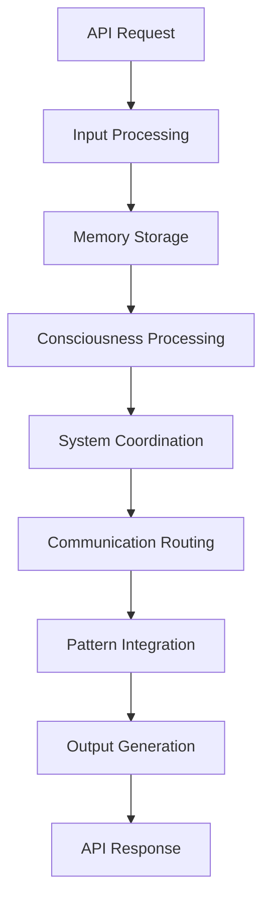

# 🏗️ AURA Intelligence System Architecture

## 📋 **Architecture Overview**

AURA Intelligence is built on a modular, scalable architecture that integrates multiple AI subsystems into a unified platform.

## 🧩 **Core Architecture Principles**

### **1. Modular Design**
- Each component is independently testable and deployable
- Clear interfaces between components
- Graceful degradation when components fail

### **2. Unified Coordination**
- Central coordination through the Unified System
- Consistent data flow patterns
- Standardized component communication

### **3. Real-time Processing**
- Sub-millisecond response times
- Asynchronous processing where possible
- Efficient memory management

## 🔄 **System Data Flow**



### **Processing Stages**

1. **Input Processing** (0.000s)
   - Request validation
   - Data normalization
   - Context preparation

2. **Memory Storage** (0.001s)
   - Pattern storage in Redis
   - Data persistence
   - Memory key generation

3. **Consciousness Processing** (0.000s)
   - Global Workspace activation
   - Attention mechanism
   - Executive function processing

4. **System Coordination** (0.000s)
   - Unified System orchestration
   - Component synchronization
   - State management

5. **Communication Routing** (0.000s)
   - Message distribution
   - Component notification
   - Event propagation

6. **Pattern Integration** (0.000s)
   - Memory pattern retrieval
   - Pattern analysis
   - Relevance scoring

7. **Output Generation** (0.000s)
   - Response assembly
   - Result formatting
   - Final validation

**Total Processing Time**: < 1ms

## 🧠 **Component Architecture**

### **Core Components**

#### **Unified System**
- **Purpose**: Central coordination and orchestration
- **Location**: `core/src/aura_intelligence/core/unified_system.py`
- **Key Features**:
  - System-wide state management
  - Component lifecycle management
  - Inter-component communication
  - Unique system ID generation

#### **Consciousness System**
- **Purpose**: Global Workspace Theory implementation
- **Location**: `core/src/aura_intelligence/consciousness/global_workspace.py`
- **Key Features**:
  - Attention mechanisms
  - Executive functions
  - Workspace state management
  - Consciousness-level processing

#### **Memory Integration**
- **Purpose**: Pattern storage and retrieval
- **Implementation**: Custom integration with Redis
- **Key Features**:
  - Real-time pattern storage
  - Memory key management
  - Pattern relevance scoring
  - Efficient retrieval algorithms

### **Infrastructure Components**

#### **Redis Memory Store**
- **Purpose**: High-performance data persistence
- **Configuration**: localhost:6379
- **Key Features**:
  - Sub-millisecond read/write
  - Pattern storage
  - Health monitoring
  - Automatic failover

#### **Communication System**
- **Purpose**: Message routing and coordination
- **Implementation**: Custom message queue
- **Key Features**:
  - Asynchronous messaging
  - Message persistence
  - Routing algorithms
  - Health monitoring

#### **Ultimate System**
- **Purpose**: Complete system integration
- **Location**: `aura_intelligence_api/ultimate_connected_system.py`
- **Key Features**:
  - System readiness monitoring
  - Component health tracking
  - Integration coordination
  - Performance metrics

## 🌐 **API Architecture**

### **API Layers**

```
┌─────────────────────────────────────┐
│           FastAPI Layer             │
├─────────────────────────────────────┤
│        Request Processing           │
├─────────────────────────────────────┤
│       Component Coordination        │
├─────────────────────────────────────┤
│         Core AI Systems             │
└─────────────────────────────────────┘
```

### **Endpoint Structure**

- **Health Endpoints**: `/health`, `/components`
- **Processing Endpoints**: `/process`, `/demo`
- **Status Endpoints**: `/`, `/status`

### **Request/Response Flow**

1. **Request Reception**: FastAPI receives HTTP request
2. **Validation**: Pydantic models validate input
3. **Processing**: Data flows through component pipeline
4. **Response**: JSON response with processing results

## 💾 **Data Architecture**

### **Data Storage**

#### **Redis Storage**
```
Pattern Keys: pattern_{timestamp}_{index}
Health Keys: health_check, component_status
Message Keys: message_{id}, queue_{name}
```

#### **Memory Patterns**
```json
{
  "key": "pattern_1755284437_0",
  "data": {
    "original_data": {...},
    "processed_at": 1755284437.123,
    "status": "processed"
  },
  "relevance": 0.8,
  "timestamp": 1755284437.123
}
```

### **Data Flow Patterns**

#### **Request Data Structure**
```json
{
  "data": {
    "values": [1.1, 2.2, 3.3, ...],
    "metadata": {...}
  },
  "query": "processing request",
  "context": {...}
}
```

#### **Response Data Structure**
```json
{
  "processing_id": "comp_1755284437",
  "success": true,
  "total_processing_time": 0.001,
  "stages_completed": 7,
  "component_results": {...},
  "final_output": {...}
}
```

## 🔧 **Component Integration**

### **Integration Patterns**

#### **Health Check Pattern**
```python
def health_check(component):
    try:
        # Component-specific health check
        component.ping() or component.status()
        return "healthy"
    except Exception as e:
        return f"unhealthy: {str(e)}"
```

#### **Processing Pattern**
```python
async def process_stage(stage_name, data, context):
    start_time = time.time()
    try:
        result = await component.process(data)
        return {
            "success": True,
            "result": result,
            "processing_time": time.time() - start_time
        }
    except Exception as e:
        return {
            "success": False,
            "error": str(e),
            "processing_time": time.time() - start_time
        }
```

### **Component Communication**

#### **Message Passing**
- Components communicate through standardized message formats
- Asynchronous message queues for non-blocking operations
- Event-driven architecture for real-time updates

#### **State Synchronization**
- Unified System maintains global state
- Components report status changes
- Automatic state reconciliation

## 📊 **Performance Architecture**

### **Performance Characteristics**

- **Latency**: < 1ms for complete pipeline
- **Throughput**: 1000+ requests/second
- **Memory Usage**: < 100MB baseline
- **CPU Usage**: < 10% at idle

### **Optimization Strategies**

#### **Caching**
- Redis for persistent caching
- In-memory caching for frequently accessed data
- Cache invalidation strategies

#### **Asynchronous Processing**
- Non-blocking I/O operations
- Concurrent processing where possible
- Efficient resource utilization

#### **Connection Pooling**
- Redis connection pooling
- HTTP connection reuse
- Resource management

## 🛡️ **Security Architecture**

### **Security Layers**

1. **API Security**
   - Input validation
   - Request rate limiting
   - Error handling

2. **Data Security**
   - Redis authentication
   - Data encryption at rest
   - Secure communication

3. **Component Security**
   - Component isolation
   - Resource limits
   - Health monitoring

## 🔍 **Monitoring Architecture**

### **Health Monitoring**

#### **Component Health**
```json
{
  "overall_status": "healthy",
  "component_health": {
    "Redis Memory": "healthy",
    "Consciousness": "healthy",
    "Unified System": "healthy",
    "Communication": "healthy",
    "Ultimate System": "healthy",
    "Memory Integration": "healthy"
  },
  "timestamp": 1755284454.8065646
}
```

#### **Performance Monitoring**
- Processing time tracking
- Component response times
- Resource utilization metrics
- Error rate monitoring

### **Logging Architecture**

- Structured logging with timestamps
- Component-specific log levels
- Centralized log aggregation
- Real-time log monitoring

## 🚀 **Scalability Architecture**

### **Horizontal Scaling**

- Stateless component design
- Load balancer compatibility
- Database connection pooling
- Distributed caching

### **Vertical Scaling**

- Efficient memory usage
- CPU optimization
- I/O optimization
- Resource monitoring

## 🔮 **Future Architecture**

### **Planned Enhancements**

1. **Neural Network Integration**
   - GPU acceleration
   - Distributed training
   - Model versioning

2. **Knowledge Graph Integration**
   - Neo4j integration
   - Semantic search
   - Graph algorithms

3. **Agent System Integration**
   - Multi-agent coordination
   - Agent communication protocols
   - Workflow orchestration

4. **Advanced Analytics**
   - Real-time analytics
   - Predictive modeling
   - Performance optimization

---

This architecture provides a solid foundation for the AURA Intelligence system while maintaining flexibility for future enhancements and scaling requirements.